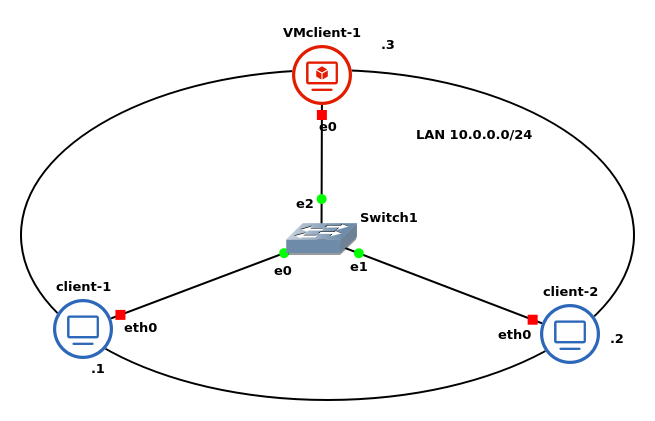

# Laboratorio introduttivo

Lo scopo del laboratorio è quello di implementare una semplice rete composta da due client docker e da un client VirtualBox, assegnando ad ognuno un proprio indirizzo ip della LAN in modo da garantire la comunicazione tra i vari *end-hosts*.
