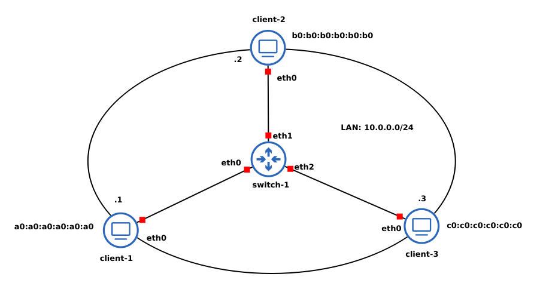
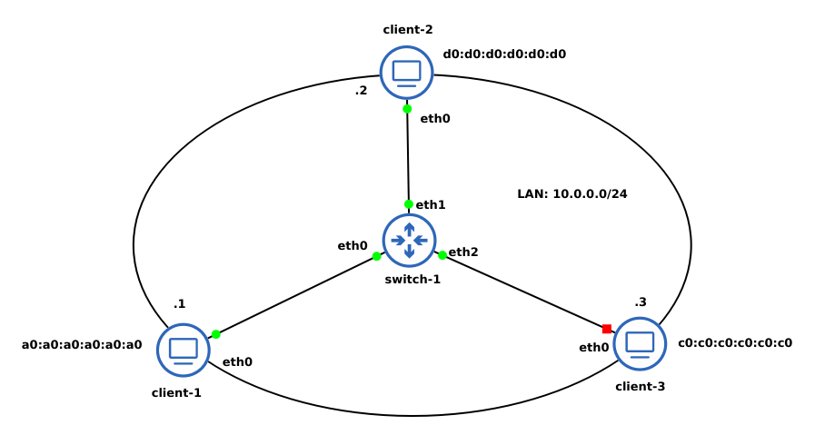

# Note nell'esecuzione del laboratorio

## Cosa sono le ACL
Le *Access Control Lists* (ACL) sono uno strumento nella sicurezza informatica poiché agiscono come guardiani digitali che regolano l'accesso alle risorse di un sistema. Organizzate in *catene*, le ACL permettono una gestione strutturata delle politiche di accesso, semplificando la definizione di regole dettagliate che costituiscono una soluzione *router-based* alla vulnerabilità delle trame *Ethernet*. In particolare, rendono più complicata l'espansione della rete attraverso l'introduzione di *switch* non autorizzati e prevengono la rete da attacchi come *MAC flooding*.

Tra i vantaggi delle ACL spicca il controllo preciso sull'accesso alle risorse, contribuendo a ridurre il traffico non necessario e favorendo la conformità normativa. Tuttavia, la configurazione di ACL complesse può risultare un compito intricato, richiedendo una comprensione approfondita delle regole e affrontando sfide come la manutenzione continua e le limitazioni di scalabilità. La precisione nella scrittura delle regole è essenziale per evitare errori che potrebbero compromettere la sicurezza del sistema mentre la loro gestione su dispositivi distribuiti o in ambienti cloud può aumentare ulteriormente la complessità operativa.

### Memo: MAC flooding
Un *MAC flooding attack* è un attacco per cui si cerca di saturare la memoria di uno switch dedicata alla *MAC address table* inviando un gran numero di pacchetti, ognuno con un indirizzo MAC diverso. In questo modo, lo switch invierà in *broadcatst* tutti i pacchetti ricevuti e l'attaccante può avere accesso a eventuali informazioni sensibili attraverso un analizzatore di rete.

## Infrastruttura
<div style="text-align: center">

</div>
Il router denominato `switch-1` è lo stesso docker container dei client con la differenza che ha più interfacce di rete e viene poi configurato come un router.

## Configurazione dei client
Sui vari client, nella cartella `/root`, sono stati definiti dei file di configurazione chiamati `ip.conf` che memorizzano i seguenti comandi:
```
ip link set dev eth0 address x0:x0:x0;x0:x0:x0 
ip addr add 10.0.0.X/24 dev eth0 
```
dove `x0` va sostituito con `a0` per il `client-1`, con `b0` per `client-2` e con `c0` per il `client-3`; allo stesso modo `X` va sostituita con `1`, `2` o `3` rispettivamente per `client-1`, `client-2` e `client-3`. 

Le configurazioni sono rese attive dal comando `bash ~/ip.conf`.

## Configurazione del router
### Creazione del bridge
Sul router si eseguono i seguenti comandi:
```
ip link add name bridge type bridge
ip link set bridge up
ip link set dev eth0 master bridge
ip link set dev eth1 master bridge
ip link set dev eth2 master bridge
```

Questi comandi servono a creare una interfaccia di tipo `bridge` con il nome specificato, la attiva e poi si collegano le interfacce `eth0, eth1, eth2` a questo bridge. In questo modo, sono stati collegati tra loro segmenti della rete. 

Queste configurazioni sono memorizzate nel file `~/ip.conf` del container e possono essere impostate col comando `bash ip.conf`.

### Aggiunta dei filtri
Per gestire la sicurezza attraverso le *Access Control List* è necessario impostare delle regole che filtrano il traffico: 

```
ebtables -A FORWARD --in-interface eth0 -s ! a0:a0:a0:a0:a0:a0 -j DROP

ebtables -A FORWARD --in-interface eth1 -s ! b0:b0:b0:b0:b0:b0 -j DROP

ebtables -A FORWARD --in-interface eth2 -s ! c0:c0:c0:c0:c0:c0 -j DROP

ebtables -A INPUT --in-interface eth0 -s ! a0:a0:a0:a0:a0:a0 -j DROP

ebtables -A INPUT --in-interface eth1 -s ! b0:b0:b0:b0:b0:b0 -j DROP

ebtables -A INPUT --in-interface eth2 -s ! c0:c0:c0:c0:c0:c0 -j DROP
```
Con questi comandi, stiamo applicando due regole diverse a ogni interfaccia **del router**. In particolare:
- le regole `FORWARD` si riferiscono alla catena per le regole di inoltro dei pacchetti tra le interfacce. Nei comandi forniti, si sta impostando di scartare tutti i pacchetti che arrivano all'interfaccia specificata se l'indirizzo MAC sorgente è diverso da quello specificato. Ad esempio, il comando `ebtables -A FORWARD --in-interface eth0 -s ! a0:a0:a0:a0:a0:a0 -j DROP` specifica di scartare tutti i pacchetti in arrivo sull'interfaccia `eth0` che hanno un indirizzo MAC sorgente diverso da `a0:a0:a0:a0:a0:a0`.

- le regole `INPUT`, invece, specificano regole di filtraggio per pacchetti diretti alla macchina stessa, cioè se l'indirizzo destinatario è quello del router.

Alla luce della precedente spiegazione, si può intuire che nel nostro caso in cui il router non riceve pacchetti destinati a lui stesso basterebbero solo le regole `FORWARD` per impedire l'inoltro di pacchetti tra macchine diverse. Eseguiamo un esperimento.

### Esperimento
<div style="text-align: center">

</div>

In questo caso, le uniche macchine attive oltre al router sono `client-1` e `client-2`. Inoltre, al `client-2` è assegnato l'indirizzo MAC `d0:d0:d0:d0:d0:d0`. 

Sul router eseguiamo il comando `bash ~/ip.conf` per creare il `bridge` e collegarvi le interfacce. Poi, però, applchiamo come unica regola `ebtable` la seguente:
```
ebtables -A FORWARD --in-interface eth1 -s ! b0:b0:b0:b0:b0:b0 -j DROP
```

Provando a far *pingare* le due macchine client, si ottengono i seguenti risultati:
- `client-1:` il comando `ping` rimane in attesa di risposte
-  `client-2:` il comando `ping` ottiene il seguente messaggio di errore: `92 bytes from 10.0.0.2: Destination Host Unreachable`. Questo significa che effettivamente l'inoltro delle porte non avviene.

