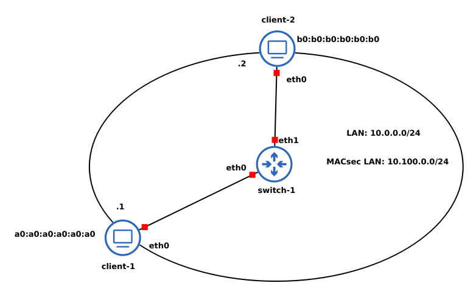

# Cos'è MACsec
Questo standard è progettato per operare al livello di controllo degli accessi ai mezzi fisici, definendo un approccio alla sicurezza di rete che include confidenzialità, integrità e protezione dal replay dei dati senza connessione. Il formato dei frame MACsec è simile a quello di Ethernet, ma presenta campi addizionali fondamentali, tra cui:
- *Security Tag*: dopo aver settato il campo *EtherType* al valore relativo a MACsec, cioè `0x88e5`, i successivi byte vengono interpretati come byte dell'header. Tra i vari campi è importante segnalare il campo `Sequence Number` che serve a prevenire *replay attacks*.

- *Integrity Check Value* (ICV): garantisce l'integrità del frame. 

MACsec organizza le stazioni connesse attraverso canali sicuri unidirezionali in *Secure Connectivity Associations*, cioè gruppi di nodi connessi attraverso un canale sicurio. Ciascuna associazione contiene *Security Associations* con chiavi distinte (SAK); è possibile che per una SA ci siano diverse chiavi, ognuna relativa a un diverso canale, in modo da agevolare la rotazione delle chiavi senza interruzioni nel flusso di dati.

La suite crittografica predefinita specificata dal protocollo è GCM-AES-128 (Galois/Counter Mode of AES con chiave da 128 bit). Successivamente, è stata introdotta GCM-AES-256, utilizzando una chiave da 256 bit per una maggiore sicurezza. Un aspetto importante da sottolineare è che **la gestione delle chiavi è al di fuori dello scope del 802.1AE** e viene definita dallo standard 802.1X-2010, sottolineando la necessità di integrare correttamente la gestione delle chiavi per una sicurezza completa.

# Note nell'esecuzione del laboratorio
## Infrastruttura
<div style="text-align: center">

</div>

Il router denominato `switch-1` è lo stesso docker container dei client con la differenza che ha più interfacce di rete e viene poi configurato come un router.

## Configurazione del router
### Creazione del bridge
Sul router si eseguono i seguenti comandi, memorizzati in `~/ip.conf`:
```bash
ip link add name bridge type bridge
ip link set bridge up
ip link set dev eth0 master bridge
ip link set dev eth1 master bridge
```

Questi comandi servono a creare una interfaccia di tipo `bridge` con il nome specificato, la attiva e poi si collegano le interfacce `eth0, eth1` a questo bridge. In questo modo, sono stati collegati tra loro segmenti della rete. Per questo laboratorio, l'unica cosa che ci interessa sul router è attivare il *bridge*.


## Configurazione dei client
Sui vari client, nella cartella `/root`, sono stati definiti dei file di configurazione chiamati `ip.conf` che memorizzano i seguenti comandi:
```bash
ip link set dev eth0 address x0:x0:x0:x0:x0:x0 
ip addr add 10.0.0.X/24 dev eth0 
```
dove `x0` va sostituito con `a0` per il `client-1` e con `b0` per `client-2`; allo stesso modo `X` va sostituita con `1` o `2` rispettivamente per `client-1` e `client-2`. 

Inoltre, sono stati definiti altri file che memorizzano le configurazioni di MACsec:

- `macsec.config`: questo file ha come scopo quello di creare un link virtuale di tipo `macsec` sull'interfaccia fisica `eth0`. Dopodiché, tira su due canali diversi sulla stessa `security association 0`, specificando come `packet number(pn)`  iniziale il valore 1. L'utilizzo delle chiavi deve essere condivisa tra i due client, ma usata per i canali opposti: la chiave usata per il canale `tx` del client-1 sarà la chiave usata per il canale `rx` del client-2. Inoltre, si può osservare che alla nuova interfaccia viene associato un ip appartenente a una sottorete diversa: questo per impedire che la comunicazione senza MACsec venga interrotta.

    ```bash
    ############# client 1 #############

    ip link add link eth0 macsec0 type macsec
    ip macsec add macsec0 tx sa 0 pn 1 on key 01 09876543210987654321098765432109
    ip macsec add macsec0 rx address b0:b0:b0:b0:b0:b0 port 1
    ip macsec add macsec0 rx address b0:b0:b0:b0:b0:b0 port 1 sa 0 pn 1 on key 02 12345678901234567890123456789012
    ip link set macsec0 up
    ip addr add 10.100.0.1/24 dev macsec0
    ```
    ```bash
    ############# client 2 #############
    
    ip link add link eth0 macsec0 type macsec
    ip macsec add macsec0 tx sa 0 pn 1 on key 02 12345678901234567890123456789012
    ip macsec add macsec0 rx address a0:a0:a0:a0:a0:a0 port 1
    ip macsec add macsec0 rx address a0:a0:a0:a0:a0:a0 port 1 sa 0 pn 1 on key 01 09876543210987654321098765432109
    ip link set macsec0 up
    ip addr add 10.100.0.2/24 dev macsec0
    ```
    
- `antireplay_macsec.conf`: contiene un solo comando che serve ad abilitare la funzionalità di antireplay:
    ```bash
    ip link set macsec0 type macsec replay on
    ```
- `encrypt_macsec.conf`: contiene un solo comando che serve ad abilitare la funzionalità di cifratura:
    ```bash
    ip link set macsec0 type macsec encrypt on
    ```
