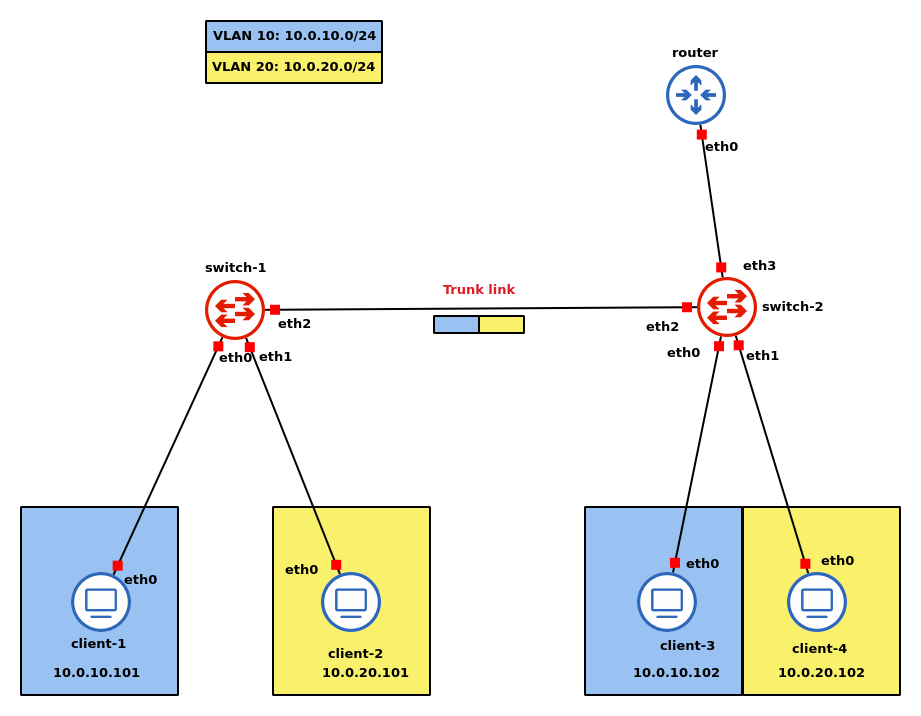

# Cosa sono le VLAN e come funzionano

Una _Virtual Local Area Network_ (VLAN) è una suddivisione logica di una rete fisica in segmenti isolati, ottenendo così delle reti separate. Per poter comunicare, due segmenti diversi hanno bisogno di un _router_, mentre i dispositivi appartenenti allo stesso segmento possono comunicare attraverso un normale switch. Per poter implementare una suddivisione in VLAN, uno switch deve avere una _Address Table_ che memorizzi, oltre al MAC address e alla porta dietro la quale è connesso, anche la VLAN a cui appartiene. Questo risulta necessario perché lo stesso switch può essere usato per creare più di una VLAN, e l'inoltro di un frame di dati deve avvenire solo verso dispositivi appartenenti alla stessa VLAN. Di conseguenza, per far comunicare due host su VLAN diverse, l'utilizzo del solo switch non basta: poiché si sta uscendo da una rete privata per arrivare a un'altra rete, è necessario l'utilizzo di un router.

Tuttavia, una VLAN può essere estesa collegando tra loro diversi switch. Il collegamento può avvenire con due _link_ diversi:

- _Access link_: sono link in cui passano frame appartenenti ad un'unica VLAN. Le porte a cui questi si collegano sono dette _Access ports_.

- _Trunk Links_: sono link in cui passano frame appartenti a più di una VLAN. Le porte a cui questi si collegano sono dette _Trunk ports_.

Nel caso di una estensione con _Trunk link_, come fa lo switch destinatario a sapere a quale VLAN appartiene il frame che riceve? Per risolvere questo problema, l'header del frame viene esteso inserendo un campo _VLAN number_ in modo che lo switch abbia tutte le informazioni di cui ha bisogno.

Tipicamente, gli _end-hosts_ sono connessi tramite _access links_, mentre dispositivi della rete sono connessi tra loro tramite _trunk links_, in modo da ridurre il numero di porte usate per la topologia della rete. In questo modo, inoltre, gli _end-hosts_ sono completamente ignari di essere dietro una VLAN e perciò inviano i loro frame _untagged_ come se li inviassero in una rete privata normale; **tuttavia è comunque possibile per loro mandare frame *tagged***. A causa di questo fatto, se uno switch riceve da un _trunk link_ un pacchetto taggato, deve modificare l'header rimuovendo quel campo e ricalcolando il CRC: un _end-host_ si aspetta di ricevere frame classici senza campi aggiuntivi nell'header. Casi particolari sono invece quelli di un server o di un _host_ che ospita più di una macchina virtuale: in questo caso è necessario usare _Trunk links_.

Non è vero però che un _Trunk link_ è attraversato **esclusivamente** da frame taggati: infatti c'è il concetto di _Native VLAN_ che può essere risparmiato. La _Native VLAN_ è sostanzialmente una VLAN di default a cui trasmettere frame non taggati provenienti da un _Trunk link_. Affinché la comunicazione abbia buon fine, è necessario che la _Native VLAN_ sia la stessa ai due capi del _Trunk Link_. La _Native VLAN_ di default è la numero `1`.

Non è vero che un _access link_ è attraversato **esclusivamente** da pacchetti _untagged_.

Concetto approfondito su [questa guida](https://www.practicalnetworking.net/stand-alone/vlans/).

# Note nell'esecuzione del laboratorio

## Infrastruttura
<div style="text-align: center">

</div>

Il router e gli switch sono lo stesso docker container dei client con la differenza che hanno più interfacce di rete e vengono configurati opportunamente.

## Configurazione degli switch

Sul router si eseguono i seguenti comandi:
```bash
##### ~/ip.conf #####
ip link add name bridge type bridge
ip link set bridge up
ip link set dev eth0 master bridge
ip link set dev eth1 master bridge
ip link set dev eth2 master bridge
```

Questi comandi servono a creare una interfaccia di tipo `bridge` con il nome specificato, la attiva e poi vi si collegano le interfacce fisiche. 

```bash
##### ~/vlan.conf #####
ip link set dev bridge type bridge vlan_filtering 1
bridge vlan add dev eth0 vid 10 pvid untagged
bridge vlan add dev eth1 vid 20 pvid untagged
bridge vlan add dev eth2 vid 10
bridge vlan add dev eth2 vid 20
```

Il primo comando serve a configurare il `bridge` in modo che funzioni con VLAN. I successivi due, invece, specificano quale id VLAN (`vid`) accettare sull'interfaccia specificata. Il parametro `pvid` (*primary VLAN*) specifica la *native VLAN*. Per inviare pacchetti untagged, si specifica l'unica vlan ammessa sul quel link come la native vlan; è cosi che si separano logicamente trunk e access links: infatti per link trunk non si usa questa opzione, come si vede negli ultimi due comandi.

## Configurazione dei client

Sui client si eseguono i seguenti comandi:
```bash
##### ~/ip.conf #####
ip link set eth0 up
ip addr add <client_ip>/24 dev eth0     # ip addr in the topology
ip route add default via <gateway_ip>   # gateway ip is <vlan_netmask>.1
```

Ad esempio, per il `client-1`, che appartiene alla VLAN 10, la configurazione è la seguente:
```bash
ip link set eth0 up
ip addr add 10.0.10.101/24 dev eth0   
ip route add default via 10.0.10.1
```

Dopo aver configurato tutti i client, se si prova a effettuare un ping tra macchine nella stessa VLAN si ha successo, mentre se si prova a contattare una macchina sull'altra VLAN non si ottengono risposte. Si procede quindi a configurare il router.

## Configurazione del router
Sul router, la configurazione avviene con i seguenti comandi:
```bash
##### vlan.conf #####
sysctl -w net.ipv4.ip_forward=1
ip link add link eth0 name eth0.10 type vlan id 10
ip link add link eth0 name eth0.20 type vlan id 20
ip link set eth0.10 up
ip link set eth0.20 up
ip addr add 10.0.10.1/24 dev eth0.10
ip addr add 10.0.20.1/24 dev eth0.20
```
Il comando `sysctl -w net.ipv4.ip_forward=1`, che deve essere eseguito come root, abilita il forwarding ip. Coi successivi due comandi si fa *attach* di nuovi link virtuali chiamati `eth0.10`, `eth0.20` all'interfaccia `eth0` specificando come tipo VLAN seguita dal suo id. In questo modo creiamo una interfaccia che ha abilitato il traffico VLAN. In pratica, si ha una sola interfaccia fisica, ma il traffico è diviso tra le due interfacce virtuali in base al tag dei pacchetti VLAN. Dopo aver attivato i link virtuali, si assegna ad ognuno di loro l'indirizzo del default gateway relativo alla VLAN in questione.

Dopo la configurazione del router, posso pingare da client1 a client2. Se osservo ciò che accade su link tra switch2 e router, vedo che i pacchetti di ping compaiono due volte: il primo è quando lo switch lo invia al router e il secondo è quando il router lo invia allo switch. Inoltre è possibile osservare che il tag cambia nei due pacchetti: il primo ha tag 10, il secondo ha tag 20: il router ha ovviamente cambiato il tag per far si che il pacchetto possa arrivare a destinazione.

**Nota**: solo il router può fare questa cosa per motivi di sicurezza

Sul router posso fare `tcpdump -e -i eth0.10 icmp` per catturare i pacchetti sull'interfaccia virtuale `eth0.10` di tipo `icmp` ottenendo più informazioni a livello 2 col flag `-e`. Qui, quello che osservo è un solo pacchetto di request e un solo pacchetto di risposta per il ping. Questo comando serve per verificare il traffico effettivo sull'interfaccia virtuale specificata.


<!--` bridge vlan show`: mostra le configurazioni-->