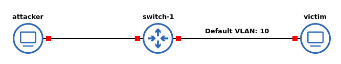
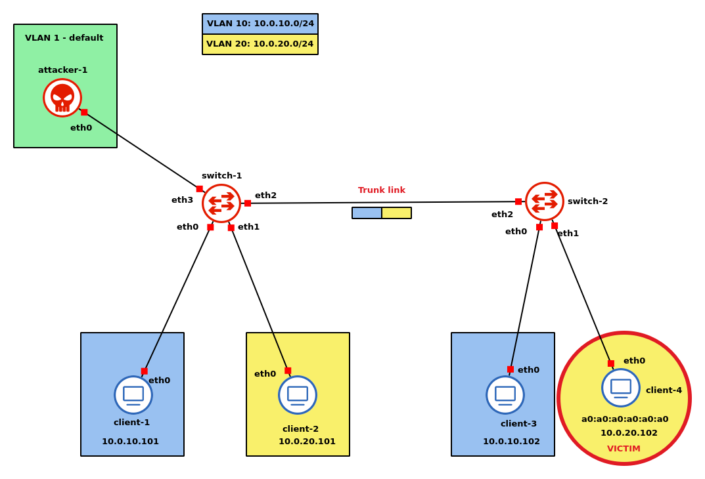

# Attacco VLAN - Double encapsulation VLAN hopping attack

## Come funziona l'attacco
L'attacco prevede che l'attaccante sia connesso tramite un *Trunk link* a uno switch, e che possa inviare pacchetti taggati con l'id della native VLAN dello switch. Ad esempio, consideriamo la seguente topologia di esempio:

<div style="text-align: center">

</div>

In questo scenario, è necessario che l'*attacker* possa inviare pacchetti diretti alla `VLAN 10` e che sia connesso allo switch tramite un trunk link.

Con queste premesse, l'attacco funziona sfruttando il comportamento tipico dello switch di quando deve inoltrare un pacchetto appartenente alla sua native VLAN: il pacchetto viene inoltrato *untagged*. Più precisamente, il tag relativo alla native VLAN, se presente, viene rimosso. 

L'idea è quindi quella di inviare un pacchetto con **due** tag: il primo deve essere quello della native VLAN dello switch, l'altro è quello della rete VLAN verso cui si vuole inoltrare il pacchetto. Così facendo, il pacchetto ricevuto dallo switch viene manipolato affinché il primo tag venga rimosso, senza sapere che a seguire c'è un ulteriore tag di un'altra VLAN. Il pacchetto che viene inoltrato, quindi, sarà un pacchetto legale diretto verso una VLAN a cui l'attacker **non** appartiene. Questo attacco, però, permette all'attaccante solo di inviare pacchetti verso un'altra VLAN, non di riceverne.

- Qual è il vantaggio per un attaccante di usare un doppio incapsulamento? Infatti l'attaccante può comunque creare pacchetti col tag diretto alla VLAN target
    
- L'attacco funziona solo se l'attaccante è connesso dietro un _access link_, altrimenti l'invio di pacchetti con VLAN 20 sarebbe lecito. In questo scenario, l'attacco funziona come descritto. Non è possibile inviare direttamente pacchetti con il tag VLAN 20 perché lo switch lo scarterebbe: si aspetta infatti da quel link pacchetti per la VLAN 1. È però possibile inviare pacchetti con doppio tag per motivi di scalabilità, ma il primo dei due deve essere comunque quello relativo alla native VLAN dello switch.

# Note nell'esecuzione del laboratorio

## Infrastruttura
<div style="text-align: center">

</div>

Il router e gli switch sono lo stesso docker container dei client con la differenza che hanno più interfacce di rete e vengono configurati opportunamente.

## Configurazione degli switch

Sul router si eseguono i seguenti comandi:
```bash
##### ~/ip.conf #####
ip link add name bridge type bridge
ip link set bridge up
ip link set dev eth0 master bridge
ip link set dev eth1 master bridge
ip link set dev eth2 master bridge
```

Questi comandi servono a creare una interfaccia di tipo `bridge` con il nome specificato, la attiva e poi vi si collegano le interfacce fisiche. 

```bash
##### ~/vlan.conf #####
ip link set dev bridge type bridge vlan_filtering 1
bridge vlan add dev eth0 vid 10 pvid untagged
bridge vlan add dev eth1 vid 20 pvid untagged
bridge vlan add dev eth2 vid 10
bridge vlan add dev eth2 vid 20
```

Il primo comando serve a configurare il `bridge` in modo che funzioni con VLAN. I successivi due, invece, specificano quale id VLAN (`vid`) accettare sull'interfaccia specificata. Il parametro `pvid` (*primary VLAN*) specifica la *native VLAN*. Per inviare pacchetti untagged, si specifica l'unica vlan ammessa sul quel link come la native vlan; è cosi che si separano logicamente trunk e access links: infatti per link trunk non si usa questa opzione, come si vede negli ultimi due comandi.

## Configurazione dei client

In questo laboratorio non serve configurare i client che non sono attaccanti o vittima. Sulla vittima si eseguono i seguenti comandi:
```bash
##### ~/ip.conf #####
ip link set eth0 up
ip link set dev eth0 address a0:a0:a0:a0:a0:a0
ip addr add 10.0.20.102/24 dev eth0
ip route add default via 10.0.20.1
```
Si può osservare che, per comodità, si è assegnato un indirizzo MAC statico alla vittima. 

Sull'attaccante, invece si esegue:
```bash
ip link add link eth0 name eth0.1 type vlan id 1
ip link set eth0.1 up
ip link add link eth0.1 name eth0.1.20 type vlan id 20
ip link set eth0.1.20 up
ip addr add 10.0.20.250/24 dev eth0.1.20
arp -s 10.0.20.102 a0:a0:a0:a0:a0:a0 -i eth0.1.20
ping 10.0.20.102 -c 5
```

In particolare, si può osservare che vengono create due interfacce virtuali:

- `eth0.1`, con id `1`. Questa VLAN ha lo stesso id della native VLAN nel link tra i due switch.
- `eth0.1.20`, con id `20`. Questa VLAN ha l'id della VLAN target. Questa interfaccia virtuale ha come *parent* l'interfaccia virtuale precedente, in modo da permettere il doppio incapsulamento.

Il comando `arp -s 10.0.20.102 a0:a0:a0:a0:a0:a0 -i eth0.1.20` serve a manipolare la cache arp: si aggiunge il *bind* tra indirizzo MAC e indirizzo ip specificati sull'interfaccia `eth0.1.20`. Con il comando `arp -a` si può effettivamente verificare l'effettivo *binding*.

## Wireshark 

Utilizzando wireshark per analizzare il traffico tra i vari link, si può osservare come tra l'attaccante e il primo switch viaggino pacchetti con l'effettivo doppio incapsulamento, mentre tra i due switch è rimasto solo l'incapsulamento relativo alla VLAN 20. Tra `switch-2` e la vittima, invece, non c'è nessun incapsulamento perché il client è collegato a una *access port*. Come previsto, i ping replay falliscono: ciò è dovuto al fatto che le richieste ARP per identificare l'indirizzo dell'attaccante non vengono soddisfatte.
