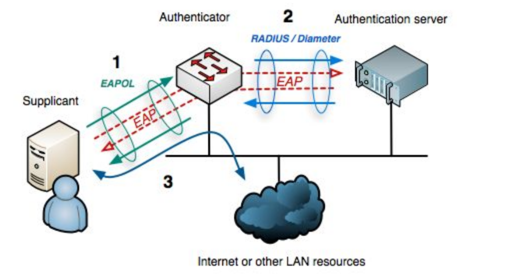
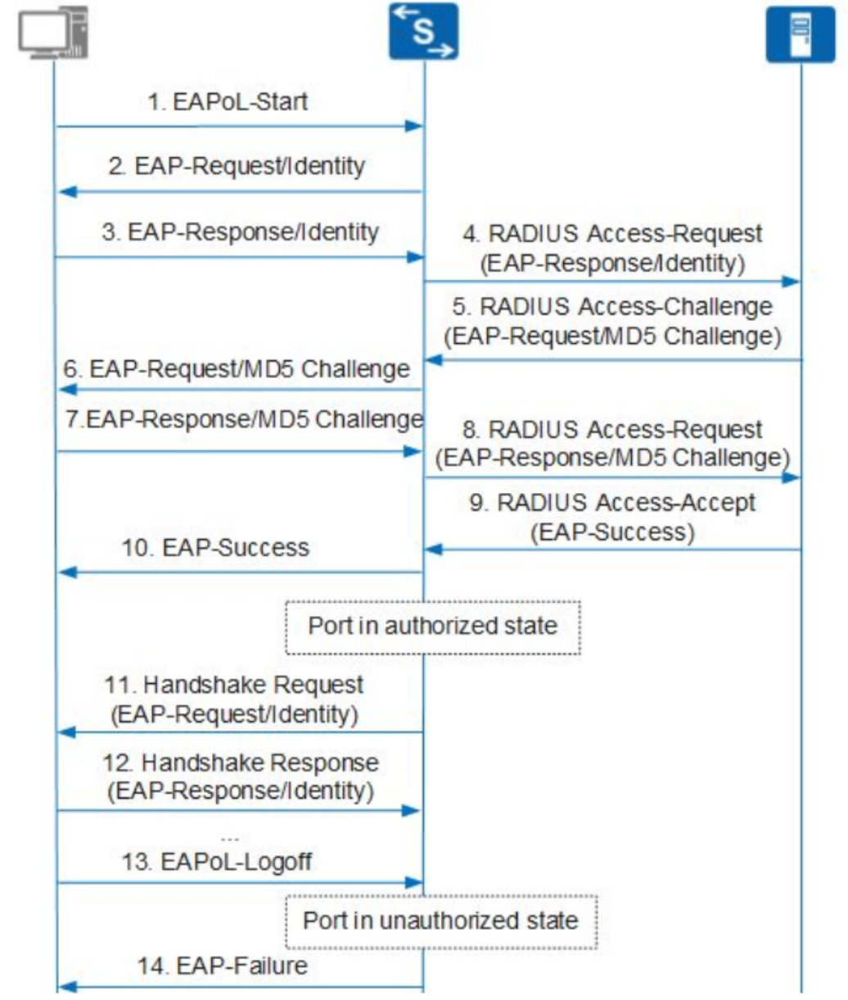
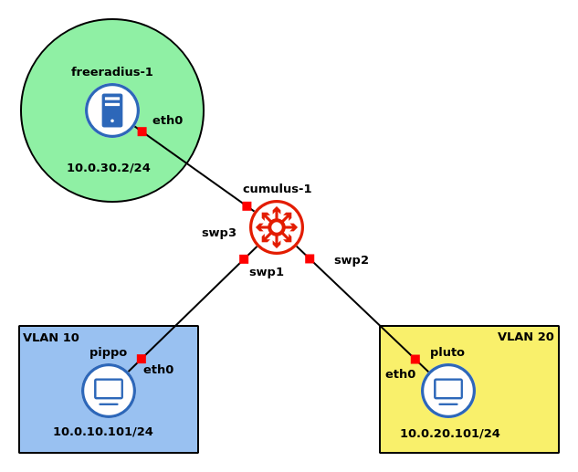

# 802.1x con EAP-MD5

## Cos'è 802.1x e come funziona

<div style="text-align: center">

</div>
802.1x è uno schema di autenticazione che sfrutta i protocolli EAP, EAPoL e RADIUS. Ci sono 3 attori principali:

- Supplicant: client che richiede l'accesso alla rete
- Authenticator: dispositivo di rete che regola l'accesso
- Authentication Server: server che verifica le credenziali del Supplicant

Questi attori collaborano in un processo di autenticazione che determina se il dispositivo richiedente deve essere autorizzato ad accedere alla rete. Lo schema della comunicazione è il seguente:

<div style="text-align: center">

</div>

1. Dopo aver inserito username e password, il client inizia una richiesta di connessione inviando un pacchetto `EAPoL-Start`.
2. L'authenticator invia come risposta un `EAP-Request/Identity` per richiedere l'username del device
3. Il client risponde con un `EAP-Response/Identity` contenente il suo username
4. L'authenticator incapsula `EAP-Response/Identity` in un pacchetto `RADIUS Access-Request`
5. L'authentication server genera una _challenge_ e la usa per creare una MD5 della password relativa all'utente ricevuto, e invia indietro la challenge in un `RADIUS Access-Challenge` contenente un `EAP-Request/MD5-challenge`
6. Il pacchetto `EAP-Request/MD5-challenge` viene inoltrato al client
7. Il client genera l'MD5 della password combinandola con la challenge e la invia all'authenticator in un `EAP-Response/MD5-challenge`
8. L'`EAP-Response/MD5-challenge` viene incapsulato in un `RADIUS Access-Request` che viene inviato al server
9. Il server effettua un confronto tra l'MD5 calcolata e quella ricevuta. Se combaciano, allora risponde con un `Radius Access-Accept` contenente `EAP-Success`
10. L'`EAP-success` viene inoltrato al client. Solo a questo punto la porta a cui si connette il client viene autorizzata.

Periodicamente l'authenticator invia pacchetti di handshake per verificare che il client sia ancora attivo. Di default, dopo 2 handshake senza risposta il client viene considerato offline.

Per andare offline, il client invia un pacchetto di `EAPoL-Logoff` all'authenticator che cambia lo stato della porta in `unauthorized`.

Per separare le risorse di rete dagli utenti non autenticati si usano VLAN diverse: in questo modo quando un utente si autentica può continuare a usare la stessa configurazione dell'interfaccia cambiando soltanto la VLAN a cui appartiene. Dopo l'autenticazione, il server assegna una ACL all'utente in modo che l'accesso tramite l'authenticator sia controllato dalle regole. Un'alternativa è quello di utilizzare le **UCL** (User Control List), cioè una collezione di dispositivi con gli stessi requisiti di accesso alla rete, impostando poi le regole per la UCL piuttosto che per il singolo device.

### Vulnerabilità

Se un attaccante è in grado di intercettare fisicamente i pacchetti di un utente autenticato, può effettuare i seguenti attacchi:

- Spoofing di IP/MAC e sostituirsi a un utente autenticato accedendo alla rete
- DoS attraverso invio di pacchetti `EAPoL-Logoff`: sono pacchetti in chiaro e possono essere inviati da chiunque

Per contrastare queste vulnerabilità si sono aggiunti allo standard MACsec e MACsec key agreement.

## Note nell'esecuzione del laboratorio

### Infrastruttura

<div style="text-align: center">

</div>

Lo switch `cumulus-1` è una macchina virtuale `Cumulus Linux V4.1`.

### Configurazione Cumulus

Essendo una macchina virtuale che verrà usata, si suppone, anche in altri laboratori, il suo file di configurazione per questo laboratorio è salvato nella cartella `~/lab05/net.conf`, che contiene i seguenti comandi:

```bash
# bridge creation
net add bridge bridge ports swp1,swp2,swp3
net add bridge bridge vids 30 # optional command
# vlan 30 configuration
net add interface swp3 bridge access 30
# routing configuration
net add vlan 10 ip address 10.0.10.1/24
net add vlan 20 ip address 10.0.20.1/24
net add vlan 30 ip address 10.0.30.1/24
# 802.1x configuration
net add dot1x radius shared-secret radiussecret
net add dot1x radius server-ip 10.0.30.2
net add dot1x dynamic-vlan
net add interface swp1,swp2 dot1x
net add dot1x dynamic-vlan require
net commit
```

Si crea un `bridge` di nome _bridge_ a cui si aggiungono le porte `swp1/2/3`. Il secondo comando configura il bridge creato per includere la VLAN 30, permettendo a tutte le interfacce collegate al bridge di partecipare a quella VLAN. Poi si specifica che la porta `swp3` è un'_access port_ per la VLAN 30.

I successivi 3 comandi aggiungono l'indirizzo ip specificato per la relativa VLAN: si sta configurando cumulus per agire come router, assegnando l'indirizzo che verrà impostato come default gateway nei client.

In seguito, si specifica il segreto condiviso tra il server radius e l'authenticator device; si specifica l'ip del server e si specifica che la configurazione della vlan degli users è gestita dinamicamente dal server radius. Il comando successivo, specifica che dietro le porte `swp1/2` ci sono i _supplicants_. Infine, prima del salvataggio delle configurazioni con il `commit`, c'è il comando `net add dot1x dynamic-vlan require` per configurare il comportamento delle VLAN dinamiche con il server radius.


Con il comando `net show dot1x interface swp1 details` si possono visualizzare dettagli sullo stato dell'interfaccia specificata rispetto al protocollo.


### Configurazione server radius

È necessario creare dei file di configurazione:

```bash
#/etc/freeradius/3.0/clients.conf
client cumulus1 {
	ipaddr = 10.0.30.1
	secret = "radiussecret"
	shortname = lab05
}
```

Questo file serve a configurare l'authenticator con il suo ip, il segreto condiviso e un nome per identificarlo.

```bash
#/etc/freeradius/3.0/users
pippo   Cleartext-Password := "pippo"
	    Service-Type = Framed-User,
	    Tunnel-Type = 13,
	    Tunnel-Medium-Type = 6,
	    Tunnel-Private-Group-ID = 10

pluto	Cleartext-Password := "pluto"
	    Service-Type = Framed-User,
	    Tunnel-Type = 13,
	    Tunnel-Medium-Type = 6,
	    Tunnel-Private-Group-ID = 20
```

Questo file serve a configurare i client: per ogni utente si specifica la password in chiaro, si specifica la tecnologia wired, il 13 indica di usare le VLAN, il `6` indica `IEEE-802` e `Tunnel-Private-Group-ID` specifica l'id della VLAN.

Poiché nei container si è impostata come permanente solo la cartella `/root`, il file di configurazione è stato creato lì. Sempre lì, è definito il file `apply_conf.sh`:

```bash
cp ./clients.conf /etc/freeradius/3.0/clients.conf
cp ./users /etc/freeradius/3.0/users

ip addr add 10.0.30.2/24 dev eth0
ip r add default via 10.0.30.1
```

Con questo comando si copiano i file nelle giuste posizioni e si assegna l'indirizzo ip dell'interfaccia e del default gateway di questo server.

Per avviare il server, c'è il file `start.sh`:

```bash
# run as daemon
service freeradius start
# or run as a process:
#freeradius -X
```

### Configurazione client

Anche qui è necessario creare un file di configurazione in `/etc`:

```bash
# @pippo:/etc/wpa_supplicant.conf
ap_scan=0
network={
    key_mgmt=IEEE8021X
    eap=MD5
    identity="pippo" # "pluto" per l'altro utente
    password="pippo" # "pluto" per l'altro utente
    eapol_flags=0
}
```

Questo file di configurazione specifica di utilizzare il protocollo `802.1x`, con `MD5 challenge`, utilizzando le credenziali specificate.

Il file di configurazione è stato creato nella `home` dove è definito anche il file `apply_conf.sh`:

```bash
cp ./wpa_supplicant.conf /etc/
ip addr add 10.0.10.101/24 dev eth0 # 10.0.20.101 per l'altro client
ip route add default via 10.0.10.1  # 10.0.20.1 per l'altro client
```

Lanciandolo con `bash apply_conf.sh`, si copia il file nella corretta posizione e si impostano gli indirizzi ip dell'interfaccia `eth0` e del default gateway.

Dopo aver eseguito queste istruzioni, non è ancora possibile pingare il server radius. Per farlo è necessario usare il comando `wpa_supplicant -B -c/etc/wpa_supplicant.conf -Dwired -ieth0`: avvia il processo in background con `-B`, specifica il file di configurazione `c`, il tipo di comunicazione `-D` e l'interfaccia `-i`.

Il comando è salvato nello script `start.sh`.
