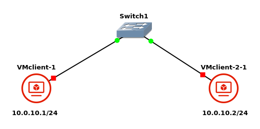

#  802.1X-2010 extensions – MACsec Key Agreement

È usato per determinare MACsec Secure Association Keys (SAK) tra stazioni che condividono la Connectivity Association Keys (CAK). La prima è la chiave di cifratura usata nei canali unidirezionali, che veniva impostata manualmente nel lab03. Tuttavia, questa chiave non è tipicamente precondivisa tra le stazioni: viene infatti generata da un `key server` e viene poi distribuita nella sua versione cifrata. Ciò che viene condiviso, invece, è la CAK: questa chiave serve a derivare altre due chiavi:

- Integrity Check Key (ICK): chiave per autenticare i messaggi
- Key Encryption Key (KEK): chiave con cui si cifra la SAK affinché venga condivisa in modo sicuro.

Per condividere la CAK ci sono due modalità:

- statica: in cui la CAK è pre-impostata manualmente sui vari dispositivi. Tipicamente è usata sui link tra dispositivi di rete.
- dinamica: in cui la CAK è derivata a partire da una Master Session Key (MSA) ricevuta dall'authentication server (radius) durante il processo di autenticazione stesso. Timicamente è usata su link tra dispositivi di rete ed end-hosts.

Ogni dispositivo della rete può svolgere il ruolo di `key server` per generare la SAK per motivi di affidabilità; la scelda avviene secondo una politica a elezione.

## Note nell'esecuzione del laboratorio

### Infrastruttura

<div style="text-align: center">

</div>

Lo switch `cumulus-1` è uno switch di default di GNS3. Si usano client VM per poter utilizzare *network manager* pre-installato su lubuntu, che implementa molti protocolli tra cui MKA. L'interfaccia a riga comanda è `nmcli`.

Useremo la `static CKA mode`.


### Configurazione client

```bash
# CKA manually configured 16 bytes
export MKA_CAK=00112233445566778899aabbccddeeff

# CKA name: 32 bytes
export MKA_CKN=00112233445566778899aabbccddeeff00112233445566778899aabbccddeeff

# delete previously created configurations:
nmcli connection del test-macsec 2>/dev/null

#nmcli connection add type macsec \  # adding new conn of type macsec
#        con-name test-macsec \ # using this name for the connection
#        ifname macsec0 \ # interface name. created last time
#        connection.autoconnect no \ # without autoconnection
#        macsec.parent enp0s8 \ # parent device
#        macsec.mode psk \ # pre-shared key
#        macsec.mka-cak $MKA_CAK \ # CAK
#        macsec.mka-cak-flags 0 \ # default
#        macsec.mka-ckn $MKA_CKN \ # name
#        ipv4.method manual \ # DHCP creates problems
#        ipv4.addresses 10.0.10.1/24 # ip address

# one line command
nmcli connection add type macsec con-name test-macsec ifname macsec0 connection.autoconnect no macsec.parent enp0s8 macsec.mode psk macsec.mka-cak $MKA_CAK macsec.mka-cak-flags 0 macsec.mka-ckn $MKA_CKN ipv4.method manual ipv4.addresses 10.0.10.1/24 # use 10.0.10.2 for other client

set +x
```


