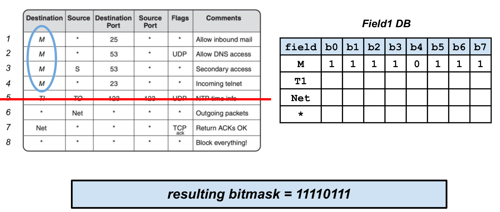
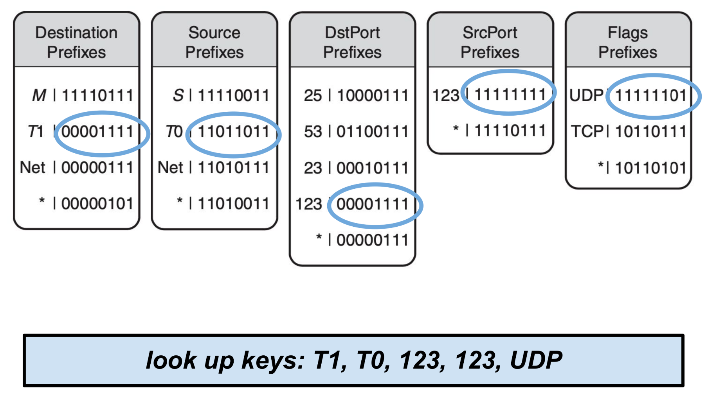
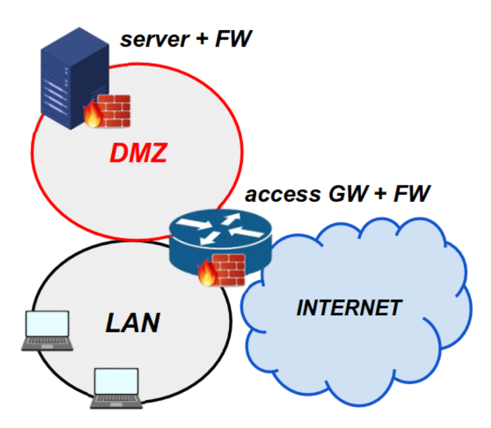
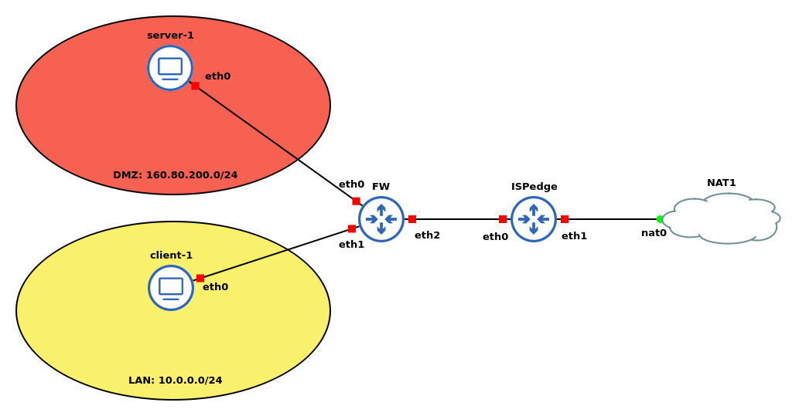

# Firewall

Un firewall è un meccanismo di difesa per le LANs. Disposto tra la rete locale e internet, è usato come difesa di perimetro: rappresenta un singolo punto in cui imporre sicurezza e controllo e isola il traffico interno. Tutto il traffico che entra o esce dalla LAN passa per il firewall, che permette il transito ai soli pacchetti che rispettano le policy locali. Le policy possono basarsi su range di indirizzi, protocolli, applicazioni e anche tipi di contenuto e la sua definizione rappresenta un punto critico. Non può però offrire sicurezza contro minacce interne o attacchi che bypassano firewall.

Per un sistema Linux, un framework per creare un firewall è `NETFILTER`: offre un punto di accesso (_hook_) alla rete ip e controlla il traffico secondo delle regole preimpostate e lo processa secondo delle azioni configurate dall'utente. Esistono 5 _hooks_ built-in e differiscono per il tipo di traffico intercettato:

- `PRE_ROUTING`: Prima della decisione di routing, quando i pacchetti arrivano sulla scheda di rete.
- `LOCAL_INPUT`: Dopo la decisione di routing, quando i pacchetti sono destinati al sistema locale.
- `FORWARD`: Dopo la decisione di routing, per pacchetti in transito attraverso il sistema.
- `LOCAL_OUT`: Dopo la decisione di routing, per pacchetti generati localmente e destinati all'esterno.
- `POST_ROUTING`: Dopo la decisione di routing, subito prima che i pacchetti lascino la scheda di rete.

Un pacchetto intercettato da questi hook passa attraverso una squenza di tabelle built-in per essere processato. Sono 4:

- `Filter` (filtro): Questa è la tabella principale per il filtraggio dei pacchetti. Le regole in questa tabella determinano se un pacchetto deve essere accettato o rifiutato . È comunemente utilizzata per configurare le regole di un firewall, decidendo quali pacchetti possono attraversare il sistema e quali devono essere scartati.

- `Nat` (network address translation - traduzione degli indirizzi di rete): La tabella Nat è utilizzata per la traduzione degli indirizzi di rete. Questo include la traduzione degli indirizzi sorgente (Source NAT - SNAT), la traduzione degli indirizzi destinazione (Destination NAT - DNAT), e altre forme di mascheramento di indirizzi (masquerade). In sostanza, questa tabella consente di modificare gli indirizzi IP e le porte nei pacchetti.

- `Mangle` (modifica): La tabella Mangle è utilizzata per modificare specifici campi dell'header dei pacchetti, come Type of Service (TOS) e Time-to-Live (TTL). È utile per applicare modifiche avanzate all'header dei pacchetti, consentendo la personalizzazione in base a determinate esigenze di routing o QoS (Quality of Service).

- `Raw` (grezzo): La tabella Raw è principalmente utilizzata per configurare eccezioni e regole speciali in relazione al connection tracking. Può essere utilizzata per marcare pacchetti per i quali si desidera che il tracking delle connessioni non sia applicato, attraverso l'uso del target NOTRACK. Questo è utile in scenari in cui è necessario escludere specifici pacchetti dalla tabella di tracking delle connessioni.

Per interagire con NETFILTER, si usa il comando `iptables` che ha la seguente struttura di base:

```
iptables <command> <chain> <table> <match> <target>
```

## Tipi di firewall

### Packet Filtering Firewall

Questo tipo di firewall applica regole a tutte i pacchetti in ingresso e uscita di tipo IP. Le regole si basano quindi principalmente sul matching dell'indirizzo ip o dell'header di trasporto: indirizzi ip sorgenti e destinatari, numero di porta sorgenti e destinatari, specifici campi dell'indirizzo ip, interfaccia...

Questo approccio ha come vantaggi quello di essere molto semplice e veloce oltre che di essere trasparente per gli utenti, ma ha anche una serie di svantaggi: non previene da attacchi relativi a vulnerabilità di livello applicativo, non supporta autenticazione degli utenti e non protegge da vulnerabilità nel protocollo TCP/IP.

### Statefull Inspection Firewall

Rafforza le regole TCP creando una directory di connessioni TCP in uscita: è una tabella le cui entry sono le connessioni attualmente stabilite. Le regole controllano le informazioni del pacchetto ma si tiene traccia anche delle informazioni riguardanti la connessione TCP stessa: ad esempio, si tiene traccia del numero di sequenza in modo da evitare attacchi basati su quel campo. Possono inoltre controllare i dati di protocolli a livello superiore.

**Nota**: Questo firewall si può applicare anche a protocolli senza connessioni, come UDP.

### Application-Level Gateway

é chiamato anche _application proxy_ perché per effettuare una comunicazione con un server vengono instaurate due connessione: la prima dall'utente al firewall, durante la quale l'utente viene autenticato; la seconda dal firewall al server remoto. Nonostante tenda ad essere più sicuro degli approcci basati su filtri al pacchetto, c'è bisogno di un maggior overhead per ogni connessione.

### Circuit-Level Gateway

Crea due connessioni TCP come il modello precedente, ma non analizza il contenuto dei pacchetti TCP. La sicurezza è qui ottenuta filtrando su quali connessioni debbano essere permesse. È tipicamente usato quando gli utenti interni sono _trusted_ e può essere usato in combinazione con l'application-level-gateway: quest'ultimo usato per il traffico in ingresso, il circuit-level sul traffico in uscita.

### Host-Based Firewall

Utilizzato per proteggere un singolo host. È disponibile nel sistema operativo oppure può essere offerto con un _add-on package_. Tipicamente è usato sui server. È utile perché si può tener conte dell'ambiente dell'host nelle regole e la protezione è indipendente dalla topologia di rete.

### Personal Firewall

Controlla il traffico tra un _personal computer_ o una workstation e la rete. Tipicamente è uno strumento software installato sul computer ma spesso si trova su un router che collega i computer alla rete DSL. Il suo scopo primario è quello di impedire accesso remoto ma può anche analizzare il traffico per individuare attività di malware o warms.

## Packet classification

Si definisce una regola come un insieme di campi _field_. Un pacchetto P fa match con una regola R se ogni campo dell'header del pacchetto fa match con il relativo campo della regola. C'è quindi un _field_ per ogni campo header del pacchetto. Un insieme di regole è detto _classifier_. Per ogni _field_ di una regola, sono ammessi 3 tipi di match:

- match esatto
- prefix match
- range match

Inoltre, ad ogni regola è associata un'azione che deve essere eseguita sul pacchetto se questo fa match della regola (nel caso del firewall classico l'azione è `drop` o `accept`). Ovviamente, un pacchetto potrebbe fare match su più di una regola: in questo caso, quella applicata sarà quella che ha un _costo_ associato minore. Di conseguenza, il costo è solo un metodo per esprimere una relazione di importanza tra le regole. Ad esempio, nelle ACL, la regola applicata è la prima incontrata che fa match; il comportamento è riproducibile usando come costo la posizione della regola nel database: infatti, man mano che si scorre, aumenta l'indice e quindi il costo. Quindi, quello che in genere si fa, è utilizzare un algoritmo di ricerca **lineare**.

Il requisto più importante per applicare questo genere di regole è quello di essere veloci. Tuttavia, fare il lookup può essere molto costoso, anche in caso di utilizzo di cache: infatti, in quest'ultimo caso, anche un 10% di miss rate può degradare notevolmente le prestazioni in caso di una lunga lista di regole. Risulta quindi necessario utilizzare un algoritmo efficiente. Si introducono quindi le _Content Addressable Memory_ (CAM), estese poi a _ternary CAM_: si tratta di un componente **hardware** in grado di ritornare il primo elemento a fare matching usando una ricerca parallela. Nelle _ternary_, ogni bit può essere 0, 1 o anche una wildcard. 

>**NOTA**: la wildcard `*` non è intesa nel suo significato comune, cioè che accetta qualsiasi valore, ma specifica il comportamento di default nel caso nessuna delle regole precedenti venga soddisfatta.

Tuttavia non sono un _silver bullet_ ed hanno diversi svantaggi:

- è difficile integrare la logica per il forward
- è necessario moltiplicare le regole nel caso di _range match_


### Tecnich _divide-and-conquer_

#### Bit Vector Linear Search

Dato un nuovo pacchetto P, si costruisce una bitmask per ogni `field` (colonna) del database. Per l'i-esimo campo del database si controlla il relativo campo del pacchetto. Nella `j-esima` posizione della bitmask ci sarà un 1 se il campo del pacchetto fa match con il valore espresso nello `j-esima` regola del database. Dopo aver costruito le bitmask, queste si mettono in `and` tra loro, e si applica la regola corrispondente al primo `1` incontrato scorrendo il risultato. 

<div style="text-align: center">
<br>

_Esempio nel caso il pacchetto P abbia `M` come `destination` field._
</div>

> Le bitmask si possono preparare a priori, in modo che quando arriva un nuovo pacchetto, si sceglie la bitmask relativa al valore del pacchetto del singolo campo, senza doverla necessariamente ricalcolare.

<div style="text-align: center">
<br>

Bitmask selezionate in caso arrivi un pacchetto con:
```
Destination = T1
Source = T0
DstPort = 123
SrcPort = 123
Flag = UDP
```
</div>

Queste bitmask evidenziate vanno messe in `and` e si seleziona poi la regola con maggiore priorià:

<div style="text-align: center">
<br>
</div>

La ricerca della regola con meno priorità, però, mantiene una complessità lineare. Una possibile soluzione è quella di usare la ```strategia di DeBruijn```.


## Note nell'esecuzione del laboratorio

Configurazione del seguente schema:

<div style="text-align: center">

</div>

Impostando le seguenti regole:

- Per l' Access GW:

  1. Permettere il traffico tra la _Demilitarized Zone_ (DMZ) e Internet
  2. Permettere il traffico tra la LAN e la DMZ solo se prodotto dalla LAN
  3. Permettere il traffico di tipo SSH, HTTP, HTTPS e DNS tra la LAN e la DMZ solo se prodotto dalla LAN
  4. Impedire tutto il traffico verso il GW eccetto per SSH e per pacchetti di risposta per flussi inizializzati da lui
  5. Impedire tutto il traffico prodotto dalla DMZ diretto al GW
  6. Permettere il traffico dal GW verso chiunque
  7. Permettere tutto il traffico ICMP

- Per il server:
  1. Permettere il traffico in ingresso solo per HTTP, HTTPS, SSH e tutto il traffico relativo a connessioni iniziate localmente
  2. Permettere tutto il traffico in uscita

### Infrastruttura

<div style="text-align: center">

</div>

### Configurazione del router

Si usano i seguenti comandi:

```bash
# ~/ip.conf
ip addr add 1.0.0.1/30 dev eth0
dhclient eth1
ip route add 10.0.0.0/24 via 1.0.0.2 #just for testing
ip route add 160.80.200.0/24 via 1.0.0.2
echo 1 > /proc/sys/net/ipv4/ip_forward
iptables -A POSTROUTING -t nat -o eth1 -j MASQUERADE
```

L'ip `/30` lo usiamo per _point to point_ link. <br>
Per l'interfaccia `eth1` configuriamo dhcp per ottenere un ip dinamicamente dalla NAT. <br>
Aggiungiamo due percorsi, di cui uno privato (anche se è sulla rete) per scopo di testing. L'altro è per indirizzare pacchetti destinati alla DMZ correttamente verso il firewall.<br>
Abilitiamo il routing con il comando `echo`.
Infine, con l'ultimo comando si garantisce che tutto ciò che esce da `eth1` sia mascherato con NAT.

### Configurazione del firewall

Impostiamo gli ip delle interfacce e abilitiamo il routing:

```bash
# ~/ip.conf
ip addr add 160.80.200.1/24 dev eth0
ip addr add 10.0.0.1/24 dev eth1
ip addr add 1.0.0.2/30 dev eth2
ip route add default via 1.0.0.1
echo 1 > /proc/sys/net/ipv4/ip_forward
```

```bash
# ~/policies.conf
export LAN=eth1
export DMZ=eth0
export WAN=eth2

iptables -F  # flush already present entries
iptables -P FORWARD DROP
iptables -P INPUT DROP
iptables -P OUTPUT ACCEPT

# tutto ciò che è nello stato established deve essere accettato
iptables -A FORWARD -m state --state ESTABLISHED -j ACCEPT

# configuro i protocolli a cui è permesso di passare
# http
iptables -A FORWARD -i $LAN -p tcp --dport 80 -j ACCEPT
# https
iptables -A FORWARD -i $LAN -p tcp --dport 443 -j ACCEPT
# ssh
iptables -A FORWARD -i $LAN -p tcp --dport 22 -j ACCEPT
# dns - nota udp
iptables -A FORWARD -i $LAN -p udp --dport 53 -j ACCEPT

# from lan to dnz
iptables -A FORWARD -i $LAN -o $DMZ -j ACCEPT
# from internet to dnz
iptables -A FORWARD -i $WAN -o $DMZ -j ACCEPT
# from dmz to internet
iptables -A FORWARD -i $DMZ -o $WAN -j ACCEPT

# gestisco i flussi prodotti dal FW
iptables -A INPUT -m state --state ESTABLISHED -j ACCEPT
iptables -A INPUT -i $LAN -p tcp --dport 22 -j ACCEPT
iptables -A INPUT -i $WAN -p tcp --dport 22 -j ACCEPT

# accetto icmp sia in input che in forward
iptables -A INPUT -p icmp -j ACCEPT
iptables -A FORWARD -p icmp -j ACCEPT
```

Con il flag `-P` imposto la default policy; in particolare quello sull'_hook_ `OUTPUT` implementa la policy numero 6. Dopo aver configurato il traffico per le connessioni stabilite e accettato il traffico in arrivo dalla LAN per i vari protocolli, si configurano esplicitamente i flussi considerando da dove arrivano e verso dove vanno. Notare che, come interfaccia di output, non c'è mai la LAN perché non si vuole accettare pacchetti verso la LAN.

### Configurazione server

Assegniamo solo gli indirizzi ip e il default gateway con:

```bash
# server - ~/ip.conf
ip addr add 160.80.200.100/24 dev eth0
ip route add default via 160.80.200.1
```

```bash
# ~/policies.conf
iptables -F # flush already present entries

# default policies
iptables -P INPUT DROP
iptables -P OUTPUT ACCEPT

# vedi NOTA
iptables -A INPUT -m state --state ESTABLISHED -j ACCEPT

# configuriamo il traffico in ingresso per protocolli specifici
# https
iptables -A INPUT -p tcp --dport 443 -j ACCEPT
# http
iptables -A INPUT -p tcp --dport 80 -j ACCEPT
# ssh
iptables -A INPUT -p tcp --dport 22 -j ACCEPT
```

Poiché è un server, non abbiamo bisogno di configurare le policies per il `FORWARD`.

**NOTA**: dopo aver impostata la default policy `iptables -P INPUT DROP`, devo per forza mettere un filtro: altrimenti tutti i pacchetti che arrivano saranno scartati. Ad esempio, se il server fa una richiesta dns, la sua risposta non deve essere scartata; ecco perché `iptables -A INPUT -m state --state ESTABLISHED -j ACCEPT`.

### Configurazione client

Assegniamo solo gli indirizzi ip e il default gateway con:

```bash
#client - ~/ip.conf
ip addr add 10.0.0.100/24 dev eth0
ip route add default via 10.0.0.1
```
