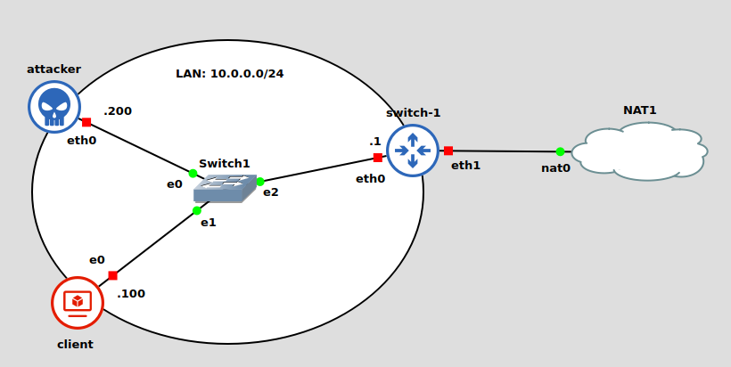

# Secure protocols

Sono protocolli il cui core risiede in cifratura, firma digitale e scambio di chiavi. Approfondiremo `ssh` come protocollo applicativo, `TLS` come protocollo a livello di trasporto e `IPsec` come protocollo a livello di rete, analizzando come garantiscono i 3 obiettivi di qualsiasi algoritmo pensato per la sicurezza:
- confidenciality: i dati sono protetti in modo che nessuno possa averne accesso?
- integrity: siamo sicuri che i dati trasmessi non sono stati manipolati?
- authentication: sto davvero comunicando con il server giusto?

## Livello applicativo: SSH
Prima si usava telnet per la connessione remota. Però, è pensato per essere totalmente insicuro (1969) tanto che i dati viaggiano in chiaro: qualsiasi _eavesdropper_ che ascolta il canale o che ha accesso ai router può leggere i dati in chiaro. Inoltre non prevede nessun meccanismo di autenticazione e nel corso degli anni sono state trovate diverse vulnerabilità nei demoni di sistema. 

SSH sta per _Secure SHell_. Il livello di trasporto si occupa dello scambio di chiavi iniziali e dell'autenticazione del server, oltre a impostare l'encryption, la copressione e l'integrity verification. Espone al livello superiore un'interfaccia per lo scambio di messaggi in chiaro e si occupa di scambiare nuovamente le chiavi dopo un'ora di connessione o dopo lo scambio di 1GB di dati.

A livello di autenticazione utente, il protocollo offre diversi meccanismi per autenticare il client, tra cui i più comuni sono quelli basati su password o su chiave pubblica.

A livello di connessione, vengono definiti i concetti di `channel`, `channel-request` e `global request`. Una singola connessione dati può prevedere diversi canali, ognuno bidirezionale e con la proprio gestione della finestra TCP. Le `channel-request` sono usate per inviare dati dello specifico canale fuori banda, come ad esempio il `resize` della finestra di un terminale. Le `global requests` invece vengono usate per richiedere l'inoltro delle porte.

Si tratta quindi di un protocollo applicativo specifico. Per rendere sicuri altri protocolli (ad esempio HTTP), potremmo incapsulare i pacchetti in un pacchetto ssh, ma non è la migliore delle idee. Inoltre, per ogni applicazione, non è detto che sia richiesto implementare una versione sicura: l'importante è che i meccanismi di sicurezza siano implementati dai livelli sottostanti.


## Transport Layer Security: TLS

TLS è un protocollo che nasce sulle ceneri di SSL. In particolare, esistono 3 versioni di SSL:
  - SSL v1: mai rilasciata
  - SSL v2: che è stato rotto
  - SSL v3: ridisegnato da 0

La versione TLS 1.0 corrisponde alla versione SSL v3.1. Nel corso del tempo, il protocollo ha avuto diversi aggiornamenti, rimuovendo ad esempio le HASH deboli nella versione 1.2 oppure utilizzando solo algoritmi AEAD nella versione 1.3.

La prima fase del protocollo prevede di stabilire una sessione:
  1. si concorda l'algoritmo da usare
  2. si condivide i segreti
  3. si effettua l'autenticazione

Quando la prima fase termina, è possibile scambiare i dati cifrati con crittografia simmetrica e autenticarli (per data integrity) con un `Keyed Message Authentication Code` (HMAC).

Nel tempo, TLS è stato attaccato su tutti gli aspetti, sia in teoria che in pratica: si è attaccato il protocollo stesso (`downgrade attack`), gli algoritmi di compressione o cifratura, e anche l'implementazione.

Con TLS 1.3, i ciphers rimanenti sono tutti `Authentication Encryption with Associated Data` (AEAD), che non necessitano di fissare una coefficiente Diffie-Helman nè di trasportare una chiave RSA. Inoltre, l'handshake iniziale è più veloce e necessita di meno scambi di messaggi.


# Note sull'esecuzione del laboratorio: HTTPs downgrade Attack

## Infrastruttura

<div style="text-align: center">

</div>

In questo Lab, los `switch` farà da host per il nostro server web. 

## Configurazione `switch-1`

Nella `root` dello switch, sono presenti:
- `CA/files`: directory che conterrà i certificati e le chiavi con cui verranno firmati
- `ip.conf`: script bash che imposta le configurazioni basic di rete
- `main.sh`: file che procede alla creazione dei certificati e all'applicazione di configurazioni
- `clean.sh`: file che rimuove tutti i certificati e le chiavi di esecuzioni precedenti

```bash
# ------- ip.conf -------
ip addr add 10.0.0.1/24 dev eth0
# chiedo un ip dinamico con dhcp sull'interfaccia connessa al nat
dhclient eth1

# abilito il forwarding
echo 1 > /proc/sys/net/ipv4/ip_forward
# elimina tutte le regole presenti nella tabella NAT
iptables -t nat -F
# aggiunge regola per mascheramendo degli indirizzi (fa NAT)
iptables -A POSTROUTING -t nat -o eth1 -j MASQUERADE
```


```bash
# ------- main.sh -------
workingDir=/root/CA/files
# inizializzazione di rete
bash ./ip.conf

cd $workingDir
# creazione dei certificati
bash root_ca.sh && bash intermediate.sh && bash webserver.sh

# concateno i certificati perché apache richiede un unico file 
cat intermediate.crt root.crt > chain.crt

# applica le configurazioni apache
bash apache2.sh
```

Vediamo in dettaglio gli script:

```bash
#------- root_ca.sh -------
# il file serial serve a tere traccia del numero seriale associato al certificato
echo -e "01\n" > /root/CA/files/serial
# genero una chiave rsa per la root CA
openssl genrsa -out root.key
# x509 è il formato standard del certificato
openssl req -new -x509 -days 1460 -key root.key -out root.crt
# IT, Lazio, Rome, NSD, NSDroot, NSDroot, <empty> sono i valori usati
```

```bash
#------- intermediate.sh -------
openssl genrsa -out intermediate.key
openssl req -new -key intermediate.key -out intermediate.csr

# per certificati intermedi, bisogna specificare un profile esplicitamente. I profili sono in /etc/ssl/openssl.conf. Il file /root/CA/files/openssl.cnf è la versione originale: la si copia nella posizione giusta e poi si aggiunge il profile per questo certificato
cp /root/CA/files/openssl.cnf /etc/ssl/openssl.cnf
cat /root/CA/files/append_to_conf_file.txt >> /etc/ssl/openssl.cnf

# firmo il certificato intermedio con quello di root e applico le estensioni riportate nel profilo creato prima
openssl x509 -req -in intermediate.csr -out intermediate.crt -CA root.crt -CAkey root.key -CAserial serial -days 365 -extfile /etc/ssl/openssl.cnf -extensions v3_intermediate_ca
```

```bash
#------- webserver.sh -------
openssl genrsa -out server.key
# quando ci viene chiesto il "Common name", bisogna usare il nome del sito web che stiamo creando (e.g: www.sito.it)
openssl req -new -key server.key -out server.csr
openssl x509 -req -in server.csr -out server.crt -CA intermediate.crt -CAkey intermediate.key -CAserial serial -days 365 -extfile /etc/ssl/openssl.cnf -extensions usr_cert
```

```bash
#------- apache2.sh -------
cd /root/CA/files
# copio il file di configurazione per creare il virtual host dove richiesto da apache2
cp sito.conf /etc/apache2/sites-available/sito.conf
# creo la root del sitoweb e aggiungo il file index.html
mkdir /var/www/sito
cp index.html /var/www/sito/index.html

# enable site: abilito il sito con la sua configurazione
a2ensite sito.conf
# abilito la modalita ssl
a2enmod ssl
# riavvio il servizio apache2
service apache2 restart
```

```html
<!------- sito.conf ------->
<!-- configurazione di un virtualhost -->
<VirtualHost _default_:443>
DocumentRoot "/var/www/sito"
ServerName www.sito.it:443
ServerAdmin angelo@sito.it
SSLEngine On
SSLCipherSuite HIGH
SSLProtocol all -SSLv2 -SSLv3
SSLCertificateFile /root/CA/files/server.crt
SSLCertificateChainFile /root/CA/files/chain.crt
SSLCertificateKeyFile /root/CA/files/server.key
<Directory "/var/www/sito">
    Options Indexes
    AllowOverride None
    Allow from from all
    Order allow,deny
</Directory>
</VirtualHost>
```

## VM-client
Dal `VM-client`, dopo aver configurato opportunamente la rete da `advanced network settings` impostando l'ip, la netmask e come gateway di default l'ip del nostro switch, modifichiamo il file `/etc/hosts` per accedere al sito web tramite hostname. 

Anteponendo `https://` all'hostname, andiamo sul sito tramite https. È necessario però _Accettare il rischio e continuare_ perché il client non riconosce la CA che ha firmato il certificato.

## Downgrade Attack

L'obiettivo sarà quello di fare un _man in the middle_ per redirigere il traffico di `VM-client` su un fake server attivo sull'`attacker`, che però non offre `https`.

Prima di tutto occorre fare il _mirroring_ del sito web. 
```bash
wget --mirror --convert-links --html-extension --no-parent -l 1 --no-check-certificate www.webank.it
```
Questo comando però mi da problemi sull'attacker, quindi è eseguito altrove e riportato staticamente in `/root`.

Anche qui, in `/root`, abbiamo diversi script:

```bash
#------- main.sh -------
bash /root/ip.conf
echo "nameserver 1.1.1.1" > /etc/resolv.conf

# abilito il forwarding ip: devo poter agire come router
sysctl -w net.ipv4.ip_forward = 1

# copio i file del sito web nella cartella giusta
cp -r /root/www.webank.it /var/www/

# salvo il file di configurazione per il fake server
cp /root/webank.conf /etc/apache2/sites-available/webank.conf

# redirigo il traffico HTTP in ingresso destinato all'indirizzo IP 66.22.35.31 e alla porta 80 verso un servizio locale sulla stessa macchina: l'ip è quello del webank reale, e lo vogliamo redirigere al nostro fake server
iptables -A PREROUTING -t nat -p tcp --dport 80 -d 66.22.35.31 -j REDIRECT

# disabilito il vhost di default
a2dissite 000-default.conf 
# attivo il server fake
a2ensite webank
# riavvio il servizio
service apache2 restart
# lancio lo script python per il mitm per fingermi router
python3 mitm.py
```

```bash
#------- ip.conf -------
ip addr add 10.0.0.200/24 dev eth0
ip route add default via 10.0.0.1
```

```bash
#------- webank.conf -------
<VirtualHost _default_:80>
DocumentRoot "/var/www/www.webank.it"

ServerName www.webak.it:80
ServerAdmin angelo@webank.it
<Directory  "/var/www/www.webank.it">
    Options Indexes
    AllowOverride None
    Allow from from all
    Order allow,deny
</Directory>
</VirtualHost>
```

Se da `VM-client` provo a connettermi a `http://www.webank.it` non vengo reindirizzato alla versione `https`, come succederebbe senza l'attacco.