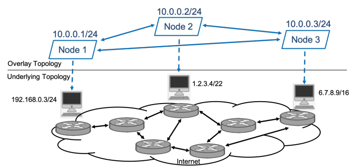

# Overlay VPN

L'obiettivo di una VPN è quello di estendere una rete privata su una rete pubblica: in questo modo gli end-host possono comunicare tra loro come se fossero nella stessa rete privata anche se in realtà si trovano in aree geograficamente diverse. Una opverlay VPN è una rete la cui topologia è costruita su un'altra topologia, insicura:

 

Le sfide da risolvere sono le seguenti:
1. Trovare un metodo che consenta a nodi geograficamente distanti di comunicare come se fossero nella stessa rete privata.

    - Una soluzione è quella di usare un incapsulamento aggiuntivo di livello `ip`: si inserisce un pacchetto ip compelto di header all'interno di un altro header ip. L'header esterno sarà quello con cui si fa instradamento classico sulla rete _underlay_, mentre il secondo verrà usato per fare instradamento sulla rete privata. I nodi di una rete devono essere a conoscenza del fatto che per comunicare con un altro nodo geograficamente distante devono mandare i pacchetti al router, mentre il router deve sapere il path verso cui instradare i pacchetti. 

2. Trovare un modo per offrire i meccanismi di sicurezza riquesti sulla rete _overlay_. 

    - Poiché la rete sottostante è insicura, bisogna utilizzare un meccanismo `end-2-end` e può avvenire tra `router-2-router` e `node-2-node`: la differenza è che, in caso di cifratura (che non è sempre richiesta), nel primo caso i dati sono cifrati sono nel tratto tra i router e non lo è nella comunicazione `router -> nodo`, mentre nel secondo caso è cifrato l'intero percorso. Il metodo migliore per creare un tunnel sicuro è quello di affidarsi a protocolli esistenti che lo offrono, come `TLS`, `SSH`, `IPsec`.

## OpenVPN

Si basa sulla virtualizzazione di device di rete: `TUN` è un virtual device per il livello _IP tunneling_, `TAP` è un virtual device per l'_Ethernet tunneling_.

Un pacchetto viene quindi incapsulato in un secondo header, ed è possibile fare NAT su questo header esterno.

Nell'invio di pacchetti tramite l'interfaccia `TUN` da parte di un host prevede che il primo hop sia un _virtual node_: nell'host stesso è presente un dispositivo virtuale che si occupa di incapsulare il pacchetto in un D-TLS tunnel stabilito in precedenza.

Per stabilire una connessione openVPN, si deve stabilire una _Public Key Infrastructure_ (PKI) che comprende:

    - coppia di `[chiave privata, certificato]` per ogni client e per il server
    - coppia di `[chiave privata, certificato]` per un _master Certificate Autority_.

Ogni certificato deve essere firmato con la chiave privata del CA affinché server e client possano autenticarsi a vicenda. I vantaggi di questa PKI sono che il server non deve mantenere i certificati o le chiavi di tutti gli utenti che possono autenticarsi: deve solo verificare che il loro certificato sia firmato con la chiave CA. Per fare questa verifica, inoltre, non deve avere accesso alla chiave privata, che può quindi essere memorizzata su un dispositivo diverso.

La comunicazione tramite openVPN può avvenrie secondo due modalità:
- TCP: che però potrebbe non essere una buona idea. Infatti si sta usando TCP due volte (una volta nell'header interno e una in quello esterno) e può quindi portare a una doppia perdita in termini di prestazioni

- UDP: e ovviamente si può usare con UDP su UDP oppure UDP su TCP.

Il protocollo openVPN prevede l'utilizzo di due canali virtuali per comunicazioni client/server: 
- `TLS control channel`: per scambiare materiali di configurazione. Per la sua inizializzazione, è necessario negoziare gli algoritmi per la cifratura e l'hash. È un'operazione simile a quella dell'HTTPS.

- `data channel`: dove viaggiano dati cifrati. Gli algoritmi di cifratura e hash usati qui **non sono negoziabili**, ma sono stabiliti nei file di configurazione di client e server.

## Lab

La topologia fisica è la seguente:

 

Mentre la topologia virtuale, è questa:

 

Una cosa interessante da notare è che `openvpn-client2` è un router: questo significa che tutti i pacchetti generati dalla rete `10.0.0.0/24` verranno incapsulati in pacchetti `openvpn`.

Per prima cosa, si esegue tutti i file `ip.conf` nei vari devices della rete. Questo file non sarà presente solo nel server e nei client openvpn.

## server

Per prima cosa si genera il certificato e la chaive per master CA. Usiamo `easy-rsa` per facilitire tutto il processo. 

Con lo script `/root/scripts/generate_ca.sh` viene creato il certificato e la chiave privata. In genere, quest'ultima è memorizzata in un'altra macchina dove vengono firmati i certificati per poi essere distribuiti. 

Ci sono poi gli script `/root/scripts/generate_server.sh` e `/root/scripts/generate_client.sh` che generano certificato e chiavi rispettivamente per il server e per i due client. Per il server, inoltre, viene generato anche un parametro diffie-helman, richiesto per il server.

>Nota: i certificati verranno generati nella cartella `/usr/share/easy-rsa/issued/`.

Ora i certificati e le chiavi devono essere distribuiti nel seguente modo:

 

Vengono generate quindi le cartelle `/root/CA/`, `/root/CA/server`, `/root/CA/client1` e `/root/CA/client2` e i certificati vengono copiati li.

> Nota: la distribuzione deve essere fatta a mano: bisogna copiare e incollare

Si può eseguire lo script `/root/first_part.sh` che automatizza il processo. Quando la copia sarà avvenuta, si può eseguire lo script `/root/second_part.sh`: serve ad applicare la configurazione ip e a copiare in directory opportune le configurazioni openvpn. Infine lancia `openvpn` in background.

## clients openvpn

Nei client, c'è un file `clean.sh` che elimina crt e key vecchie. C'è anche il `main.sh` che deve essere eseguito dopo aver copiato correttamente le nuove chiavi e i certificati nella cartella `/root/ovpn`. Questo script non fa altro che inizializzare la configurazione ip e avviare il processo `openvpn` in background.