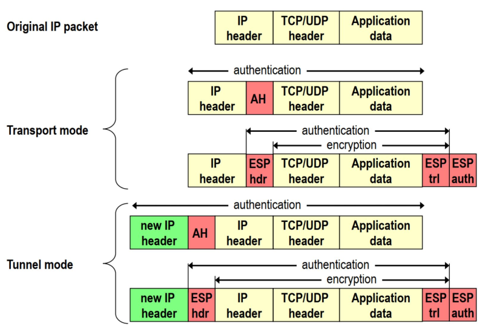
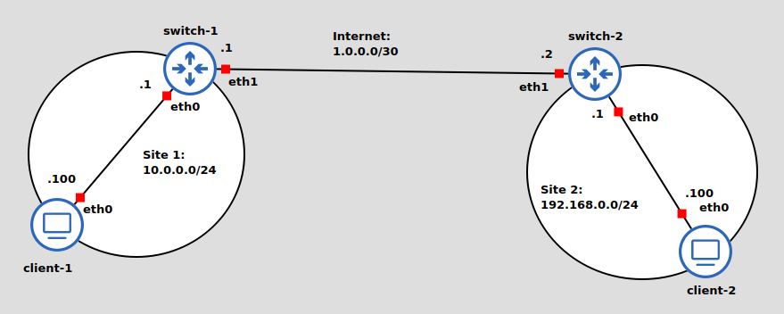

# IPsec

Ipsec è un altro protocollo di sicurezza, anche se più in generale ci si riferisce a IPsec come una _suite di protocolli_. IPsec lavora a livello di rete e definisce alcuni concetti chiave:

- **Security Association (SA)**: definiscono i materiali crittografici tra due entità (host2host, host2router, gateway2gateway) e sono monodirezionali: ciò significa che per ogni comunicazione ce ne sono 2.

- **Security Association Database (SAD)**: è un database che conserva, per ogni SA, il relativo materiale crittografico.

- **Secure Parameter Index (SPI)**: è un indice univoco che serve a indentificare una SA e rappresenta quindi anche la chiave con cui si fanno ricerche nel SAD.

La gestione delle chiavi può essere sia manuale, usata tipicamente in scenari piccoli e meno sicura perché una SA può avere vita infinita (non c'è re-keying), oppure dinamica, sfruttando il protocollo **IKEv2**, che si occupa di stabilire e mantenere dinamicamente le SA: ciò significa che una SA è on demand. È composto principalmente da 2 parti:

1. Si stabilisce una **IKE SA** per i messaggi di controllo del protocollo stesso
2. Vengono stabiliti dinamicamente vari **child SA** per i vari flussi di dati on demand. Per ogni **IKE SA** possono esserci diversi **child SA**

Come detto, IPsec è una suite di protocolli. Questa definizione è dovuta al fatto che è possibile utilizzare due diversi protocolli:
- **Authentication Header (AH)**: è un protocollo che offre autenticazione e integrità su tutto il pacchetto, ma non cifratura

- **Encryption Secure Payload (ESP)**: è un protocollo che offre cifratura e autenticazione sul payload ma non sull'header

Inoltre, IPsec offre la possibilità di operare secondo 2 modalità differenti:  **Transport mode** e **Tunnel mode**. La differenza è che, nella seconda modalità, l'intero pacchetto viene usato come payload di un nuovo pacchetto ip; come poi i campi vengano protetti dipende dal protocollo usato. La modalità di trasporto viene usata tipicamente per connessioni end2end.

 

## Security Policies
IpSec offre anche un meccanismo di politiche, e sono mantenute in un **Security Policy Database (SPD)**. Si tratta di politiche di tipo _match-action_ in cui, se la parte _match_ viene rispettata da un certo pacchetto, allora gli viene applicata la relativa _action_. Ad esempio:

| **match** | **action**|
|-----------|-----------|
| `IP source/dest/netmask == 10.0...` | `BYPASS` (non fare niente)`/DISCARD/PROTECT` (applica IPsec AH/ESP) |

Quindi, ciò che succede con IPsec vari per pacchetti in input e output:

- **output**: si cerca una policy nel SPD e, se si trova, il pacchetto è passato al SAD. Se c'è una SA, il pacchetto viene processato secondo l'_action_ del SPD con i parametri trovati nella SA. Se non viene trovata una SA, può avvenire una procedura di negoziazione tramite IKE.

- **input**: si cerca una SA nel SAD trami SPI e ip dest/source per cercare i parametri con cui decriptare e validare il pacchetto e infine si ricercano policies da applicare nel SPD.

## Lab

IPsec è nativamente supportato dal kernel linux ma i database e le negoziazioni SA devono essere configurati tramite tools; noi useremeno `strongswan`.

La topologia è la seguente:

 

Il laboratorio è molto semplice e consiste, oltre alla configurazione classica di ip, di creare un file di configurazione `/etc/swactl/conf.d/ipsec.conf` nei router. Poi, attraverso opportuni comandi di `stronswan`, si carica la configurazione e si inizia una comunicazione ipsec. 