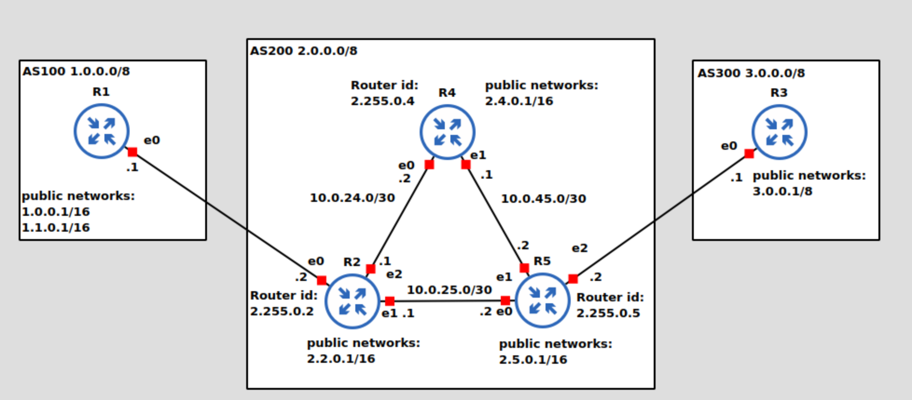

# BGP 

Si definiscono _protocolli di routing_ i protocolli che popolano le routing table in base a regole amministrative e configurabili. È possibile che inseriscano più di un percorso verso lo stesso ip destinazione, e sarà poi un algoritmo interno a stabilire il migliore in base al prefisso. Si dividono in due categorie:

- Interior gateway protocols (IGP): lavora all'interno del singolo AS. Si divido principalmente in due sotto-categorie: 
    - distance vector: prevedono che lo scambio delle routing table avvenga solo tra nodi vicini 
    - link-state: prevedono che l'intera rete sia sincronizzata con le informazioni di routing di ogni nodo

    Principalmente per questo tipo di protocolli, esiste il concetto di _Administrative Distance (AD)_: quando ci sono più possibilità per la scelta del protocollo di routing da usare, si assegna a ognuno di essi un indice numerico (AD), che è tanto più basso quanto il protocollo è preferito.

    Non tratteremo gli IGP nel corso.

- Exterior gateway protocols (EGP): interagisce con diversi AS

Un autonoumous system (AS) è una rete che è amministrata e controllata da una singola organizzazione. A un AS viene associato un numero (ASN: AS number) e uno (o più) ranges di indirizzi ip. Poiché ogni AS può usare le proprie regole, gli EGP nascono per facilitare la comunicazione tra essi. Il protocollo principe è **Border Gateway Protocol (BGP)**. 

## BGP basics
BGP è un distance vector (per la precisione un **path vector**) e costruisce la propria tabella di routing basandosi sui messaggi ricevuti dai suoi vicini. In questi messaggi, è presente l'intero path di AS che un pacchetto deve attraversare per raggiungere una certa destinazione. La grandezza da minimizzare per fare l'instradamento è quindi il numero di AS da attraversare. BGP utilizza TCP e, quando due nodi stabiliscono una connessione TCP, diventano **neighbors**. Alla prima connessione, i due nodi si scambiano la lora intera routing table, mentre successivamente vengono comunicati solo eventuali aggiornamenti alla tabella. Inoltre, i vicini si scambiano ripetutamente pacchetti di _keep alive_ per verificare che siano ancora up; dopo 3 messaggi del genere senza risposta un vicino è considerato spento.

I messaggi BGP sono solo di tipo _unicast_ e possono essere di 4 tipi:
- `OPEN`
- `KEEPALIVE`
- `UPDATE`
- `NOTIFICATION`

BGP può essere usato anche all'interno dello stesso AS: in quel caso si parla di _internal BGP (iBGP)_, mentre in generale si parla di _external BGP (eBGP)_. Quando si costruisce un messaggio di aggiornamento dei vari path, il numero dell'AS viene aggiunto solo nel momento in cui si lascia l'AS. 

È quindi facile accorgersi della presenza dei loop dal momento che tutte le rotte sono elencate. Tuttavia, per evitarne la creazione, un percorso appreso tramite iBGP non viene mai propagato verso altri nodi iBGP: in questo modo non è necessario avere una sessione full-mesh.

Ogni messaggio di `UPDATE` ha una serie di attributi che servono a specificare informazioni sui path, preferenze sui routes o altri tipi di informazioni. Questi attributi possono essere modificati aggiunti o rimossi da ogni nodo possono influenzare la scelta di un percorso da parte di un altro peer: infatti si possono aggiungere AS fittizi a un percorso in modo da condizionare la scelta dei successivi hops. Un altro uso interessante è che con gli attributi si può far scegliere un percorso non solo rispetto alla lunghezza del path, ma anche in base ad altri criteri. Uno di questi attributi è il **Community attribute**: si tratta di un valore numerico che può essere assegnato a uno specifico prefisso e specifica ai vicini delle azioni da svolgere in caso di modifica ad altri attributi. Alcuni esempi sono:

- `NO_EXPORT`: un percorso con questo valore non deve essere propagato al di fuori della confederazione 
- `NO_ADVERTISE`: un percorso con questo valore non deve essere propagato a nessun altro peer BGP
- `Internet`: un percorso con questo valore deve essere inoltrato a tutti gli altri router
- `Local-as`: un percorso con questo valore deve essere inoltrato a peer appartenenti al singolo AS

## Lab 

Il lab consiste in un semplice scenario BGP. La topologia è la seguente:

 

