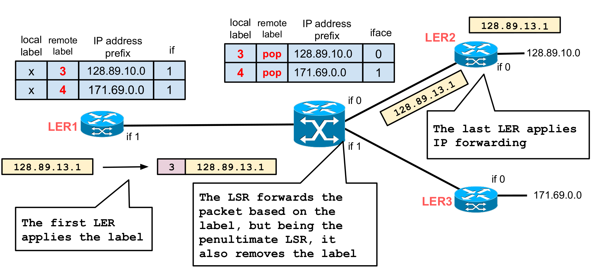

# MPLS
L'idea è quella di associare un'identificativo (_label_) ad ogni pacchetto in modo da poter applicare il meccanismo di fast forwarding basato su label switching. Un _label switch_ deve avere dell'hardware dedicato:
- control component: insieme di moduli dedicati al binding e all'allocazione di label tra nodi vicini
- forwarding component: in grado di effettuare il forwarding basandosi sulle label

I due componenti devono essere indipendenti: possono così utilizzare protocolli diversi.

La codifica della label viene effettuata in modo diverso in base al protocollo di livello 2 utilizzato: se questo prevede l'uso di un campo dedicato per una label, allora viene utilizzato quello, altrimenti tra il livello 2 e il livello 3 viene aggiunto un header MPLS.

Distinguiamo ora i diversi dispositivi per una rete MPLS:

- `Label Edge Router (LER)`: sono i router responsabili di aggiungere o rimuovere etichette in una rete MPLS e si comportano in questo modo perché comunicano con la rete esterna;

- `Label Switch Router (LSR)`: sono i router interni di una rete MPLS che si occupano di legger il valore di una etichetta di un pacchetto, decidere dove inoltrarlo in base a una tabella di routing, cambiare l'etichetta in modo opportuno e infine di inoltrare il pacchetto

- `Label Distribution Protocol (LDP)`: il ruolo è di collaborare coi protocolli di routing tradizionali per distribuire etichette tra i nodi della rete

- Forwarding Equivalence Class (FEC): insieme di pacchetti ip che vengono trattati nello stesso modo (ad esempio inviati lungo lo stesso percorso)

- `Label Switching Path (LSP)`: percorso di un pacchetto attraverso uno o più LSR.

Il funzionamento di una rete di questo tipo si basa sul `push, pop & swap` delle label: quando un pacchetto arriva a un LER tramite il classico instradamento ip, questo elabora l'header e poi aggiunge (`push`) la label relativa, per poi inviarlo al next hop, che è tipicamente un LSR. Il router che riceve il pacchetto cambia (`swap`) la label e inoltra il pacchetto. Quando il pacchetto arriva a un LER per essere inviato all'esterno della rete, la label viene rimossa (`pop`) dal pacchetto in modo che venga instradato secondo il classico routing.

Un'altra operazione è quella di `control`, che viene utilizzata da LDP per distribuire nei nodi della rete MPLS l'associazione tra etichetta e prefisso.

<div style="text-align: center">

</div>


In uno scenario del genere, se `LER1` deve inviare un pacchetto a `128.89.13.1`, farà lo `swap` tra l'etichetta locale e quella remota. Tuttavia, non c'è etichetta locale, quindi semplicemente la aggiungerà. Viceversa, `LSR` la rimuoverà in modo che il prossimo hop possa fare instradamento classico tramite ip.

La distribuzione delle etichette può avvenire in due modalità differenti:

<div style="text-align: center">

</div>

1. `on Demand`: la richiesta di una label avviene solo quando è necessario usarlo
    - vantaggi: minor utilizzo di banda con conseguente ottimizzazione delle risorse
    - svantaggi: possibile ritardo iniziale dovuto alla richiesta di una label per un certo percorso

2. `Unsolicited`: le label vengono distribuite interamente a tutti i nodi vicini a priori
    - vantaggi: c'è più velocità nell'istradare un pacchetto perché si ha già a disposizione la label
    - svantaggi: possibile spreco di risorse di rete se la distribuzione coinvolge etichette che non verranno mai usate


> nota: è possibile aggregare diverse etichette in un singolo LSP per specificare percorsi diversi, impilati in ordine di priorità


## Intra-AS VPN
Si basano su BGP/MPLS e definiscono i seguenti elementi:

- `customer edge`: è il router _company side_ che interagisce con l'_ISP_ che offre il servizio VPN BGP/MPLS. L'unico peer è un `provider edge` (vedi dopo) con cui scambia informazioni BGP.

- `provider edge`: è l'access router dell' ISP a cui si collegano uno o più `customer edge`. Oltre alle funzionalità base di ip, svolge anche il ruolo di _Label Edge Router_ nella rete MPLS dell'ISP.

- `provider router`: _Label Switched Router_ della rete MPLS dell'ISP

- `MPLS/VPN backbone`: rete MPLS con i vari _Label Switched Path_ configurati per interconnettere i `provider edge`.


Il forwardin è semplice ma c'è un problema: quando il pacchetto arriva all'ultimo PE, il routing viene fatto tramite la sua routing table. Il problema è che due VPN diverse potrebbero scegliere la stessa netmask per le proprie VPN e in quel caso il routing sarebbe ambiguo. La soluzione è quella di usare un doppio incapsulamento MPLS in modo che la label esterna identifichi il LSP mentre quella interna servirà per identificare la VPN:

<div style="text-align: center">

</div>
<br>

Il `PE` finale deve avere una routing table per ogni VLAN connesse a lui e sono chiamate _VPN Routing and Forwarding tables_ (VRF); ogni entri di una VRF contiene una tupla fatta così: `<VPN network address, VPN mask, Next PE IP Address, Internal label, Output Interface>`. Inoltre, un `PE` memorizza anche una _Global Forwarding Table_ (GFT) che memorizza le seguenti informazioni per ogni riga: `<PE IP address, external label, Output Interface>`. La configurazione della GFT è fatta dal provider durante il set-up, e può essere popolata manualmente o automaticamente, nel caso di particolari protocolli. Le VRF tables, invece, contengono 2 categorie di forwarding: 
- _Local site_: in questo scenario la configurazione può essere manuale o automatica tramite particolari protocolli
- _Remote site_: questi percorsi sono ottenuti solo tramite l'utilizzo di un'estensione di BGP-4: _Multi-protocol interio BGP_ (MP-iBGP). In questo caso, le tabelle si sincronizzano grazie a degli "annunci" che si scambiano i PE vicini: deve però esistere un rete overlay full-mesh. Questi annunci possono però portare informazioni riguardanti prefissi relativi a diverse VRF.
    > Nota: lo scambio avviene tramite una rete ip e perciò è lecito assumere che nodi che distano un hop tra loro abbiano costo unitario
    
Tramite gli annunci, il motore BGP interno ad ogni PE è in grado di calcolare la label e il next hop per ogni VPN elencata. Anche qui, però, c'è lo stesso problema presentato precedentemente: nell'annuncio possono esserci due VPN con lo stesso indirizzo. Per risolvere questo problema, ad ognuna di esse è associato un id univoco chiamato _Route Distinguisher_ di 64 bits.

Per quanto riguarda la topologia, risulta che la topologia di una VPN corrisponde a quella overlay in cui vengono scambiati i messaggi MP-iBGP: infatti la topologia VPN sarà l'insieme dei nodi con il costo minore, ma i nodi tra cui vengono scambiati i pacchetti MP-iBGP sono a distanza 1. Questo aspetta risulta un problema solo nel caso si desideri una topologia diversa per la singola VPN. Esistono eventuali 2 soluzioni:
- creare una overlay differente, ma richiede costi di gestione elevati
- usare una overlay full-mesh e applicare dei filtri sull'arrivo dei pacchetti:
    <div style="text-align: center">
    
    </div>
    <br>

    Il filtraggio viene fatto tramite un identificativo a 64 bit detto _Route Target_: questo valore specifica quali rotte sono visibili e accettate in una VPN. È un valore che è associato a ogni elemento negli annunci MP-iBGP e ogni VPN può essere configurata per accettare solo un sottoinsieme di _route targets_.


## Lab 

<div style="text-align: center">

</div>
<br>


Se si ha un solo router interno, per esportare tutte le rotte basta usare il comando: `network 0.0.0.0/0 area 0` all'interno della configurazione `router ospf`.

creiamo una VRS per ogni VPN.

> per lanciare `sysctl -p` all'avvio, basta aggiungerlo nel file `start.sh` che è specificato nel container come comando di avvio

```bash 
#---- vtysh -----
# enable ldp e accede alla console per configurare ldp
mpls ldp
# usato per source address 
router-id 3.3.3.3
# uno dei 2 modi di operazione - non approfondito
ordered-control
# specifica di usare solo ipv4
address-family ipv4
# inizia l'ldp discovery nella rete
discovery transport-address 3.3.3.3
# quali interfacce usano mpls?
interface eth1
interface lo
```

```bash
#---- vtysh -----
# abilita bgp con ASN = 100
router bgp 100
# id
bgp router-id 1.1.1.1
# neighbor: come per BGP standard
neighbor 2.2.2.2 remote-as 100
neighbor 2.2.2.2 update-source 1.1.1.1
neighbor 3.3.3.3 remote-as 100
neighbor 3.3.3.3 update-source 1.1.1.1
address-family ipv4 unicast
neighbor 2.2.2.2 next-hop-self
neighbor 3.3.3.3 next-hop-self
# attiviamo MP-iBGP con dei neighbor specificati
address-family ipv4 vpn
neighbor 2.2.2.2 activate
neighbor 2.2.2.2 next-hop-self
neighbor 3.3.3.3 activate
neighbor 3.3.3.3 next-hop-self
```