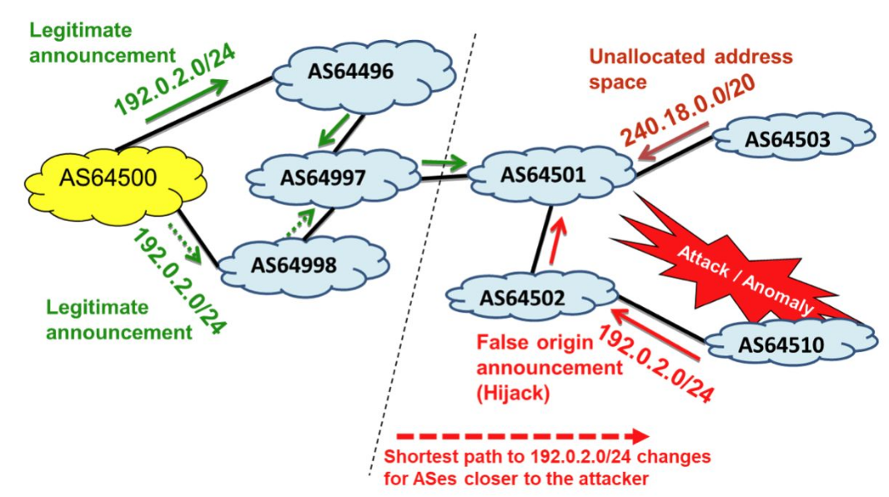
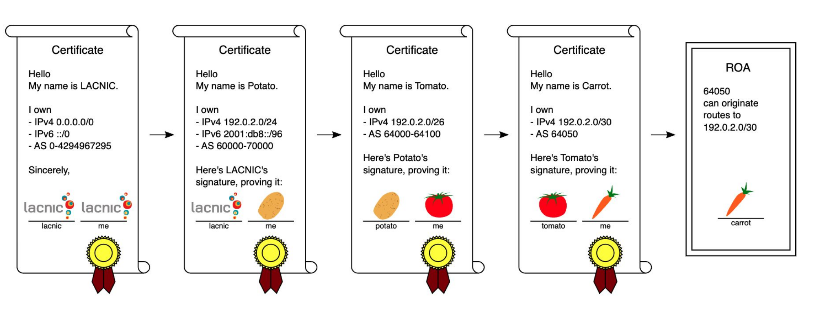
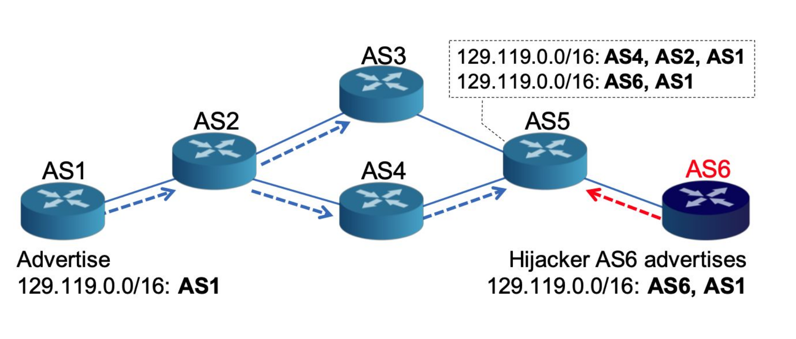
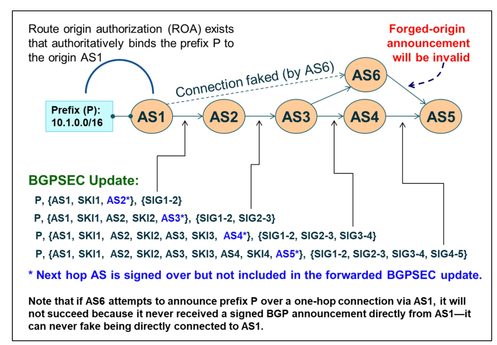
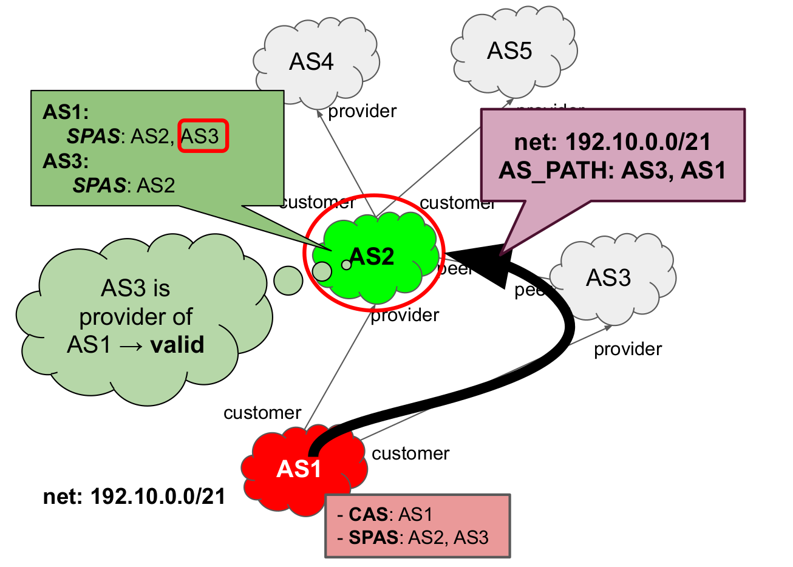

# BGP security

La sicurezza dei messaggi BGP è un grosso problema ancora oggi. Gli attacchi possono riguardare:
- `control plane`
- `data plane`
- `underlaying protocol`

Inoltre, i messaggi BGP possono essere spoofati in modo da inserire informazioni false nelle routing table dei vari peer. Una possibile contromisura è l'utilizzo della funzione _traceroute ICMP_. Un caso particolare di questo attacco consiste nell'invio di _TCP RESET messages_, in modo che i due peer interrompano la comunicazione e ritirino i percorsi tra di essi. I tempi di recupero da questo attacco dipendono dalla quantità di nodi coinvolti.

Ci sono poi le _session hijacking_, che consistono nell'introdursi in una sessione BGP attiva. L'obiettivo può essere il semplice reset o anche il cambiamento di percorsi usati, in modo da dirigere il traffico su un'altra rotta su cui è più facile per l'attaccante effettuare _eavesdropping_ e analisi del traffico. Ci si può proteggere usando un hash MD5 su ogni segmento TCP che viene così autenticato, ma si tratta di una soluzione obsoleta. Oggi, è possibile utilizzare la **TCP-AO** (Authentication Option), che consiste nell'utilizzo di un algoritmo robusto per generare un MAC e offre una maggiore generazione e coordinazione per l'uso delle chiavi. Un'alternativa è la **TTL hack**: si sfrutta il fatto che i peer di BGP sono tipicamente adiacenti (a distanza 1). La sicurezza si basa sul fatto che i peer si aspettano un determinato valore di TTL. Tipicamente si sceglie 255 per i peer adiacenti, 254 per i peer a distanza 2 e così via.

Un'altra vulnerabilità è il _route flapping_: si verifica quando un percorso viene ritirato e poi re-inserito nella route table di un nodo. Quando questo accade sufficientemente velocemente, può portare in definitiva a un effettivo Denial of Services. Una possibile soluzione è quella del **Route Flapping Damping**, che consiste nell'ignorare un router che fa flapping per un tempo esponenziale di volta in volta. Questa soluzione, però, protegge da errori naturali della rete, e non da potenziali attacchi.


## Vulnerabilità Control plane

### Prefix hijacking e annunci di indirizzi non allocati
<div style="text-align: center">

</div>
<br>

Nell'immagine di esempio precedente, si può osservare che `AS64500` genera un annuncio per l'indirizzo di rete `192.0.2.0/24`. Lo stesso fa `AS64510` in modo illecito. Per una porzione degli AS presenti, il path più breve è quello illecito e quindi il traffico verrà rediretto verso quell'AS, senza mai arrivare a destinazione. La stessa cosa succede se si genera un prefisso di rete _più specifico_ rispetto a uno precedentemente annunciato: infatti il protocollo IP si basa sul _longest prefix match_. 

Il problema opposto è quello di generare un indirizzo allocato ma non usato, come fa nell'immagine `AS64503`; questo problema si chiama _prefix squatting_.

La soluzione per questo problema è quello di fare _filtering_ sui pacchetti in ingresso ma anche in uscita: potrebbero esserci errori.


### BGP UPDATE modification
I messaggi BGP contengono il campo `AS_PATH` che specifica il numero degli AS che verranno attraversati se viene seguito quel path. Un AS malevolo potrebbe rimuovere dei numeri per far sembrare il percorso più corto, in modo da far transitare su di esso anche pacchetti che normalmente non sarebbero passati di là, con l'obiettivo di aumentare i guadagni o di fare _eavedropping_ sul traffico.

Un altro esempio è quello del _Kapela-Pilosov attack_ e consisten nel sostituire l'indirizzo ip di un annuncio con uno più specifico, in modo da spingere i vicini a reindirizzare il traffico attraverso l'AS malevolo. In questo attacco l'AS-path non viene modificato, in modo da far sembrare l'annuncio leggittimo.

### Route Leaks

Si verifica quando un peer fa advertising di un route per cui non dovrebbe. Infatti non tutte le rotte devono essere conosciute dai peer: questo dipende dalla natura del collegamento: ad esempio, se tra due AS c'è una relazione di tipo `P2C` (vedi notazione), non è necessario che il provider annunci al customer la rotta per un certo prefisso P; Questo però può capitare a causa di un attacco oppure a causa di una miscunfigurazione.
Le conseguenze per questa "vulnerabilità" sono:
- dirottamento del traffico: ciò implica una eventuale analisi malevola del traffico
- sovraccarico di un router se il route leak riguarda diversi router contemporaneamente: c'è un picco di traffico inatteso che causa il drop di diversi pacchetti e può causare un DoS

La soluzione principale per questo problema è l'applicazione di filtri. Esistono dei database che contengono le informazioni di routing dichiarate dagli operatori di rete: sono gli _Internet Regional Registries_ (IRRs) e i _Routing Internet Registries_ (RIRs). Le informazioni contenute qui vengono spesso usate dai router BGP per creare i filtri.


## RPKI e BGP-origin validation
Le risorse allocate e le politiche di routing sono disponibili negli _Regional Internet Registries_ (RIRs) e _Internet Routing Registries_ (IRRs). Sono una sorta di database che memorizzano l'associazione tra AS e prefissi: forniscono le rotte dichiare dagli operatori. Per essere affidabili, questi dati devono essere autenticati: nasce quindi RPKI per certificare le informazioni di routing. C'è una gerarchia:
```
                       IANA 
                        |
                       RIRs  <--- continentali
             ...........|...........
             |                     |
            ISP               enterprises
 ............|............
 |           |           |
ISP       customer  enterprises
```
Il meccanismo per autenticare i certificati è simile a quello per TLS: IANA ha un certificato self-signed e firmerà un certificato per i RIRs. RIRs possono firmare col proprio certificato quelli degli ISP e così via.
La certificazione delle risorse può avvenire in due modi differenti:
- `hosted`: anche detta _End-Entity_; l'organizzazione gestisce direttamente i propri certificati e firma in prima persona i certificati ai propri blocchi di indirizzi IP. Questi approccio offre un'alta autonomia all'organizzazione ma aumenta la difficoltà nella gestione dei certificati.
- `delegated`: anche detta _Certification-Authority_; l'organizzazione delega un'autorità per gestire i propri certificati e firmare quelli dei propri blocchi di indirizzi IP. Questa modalità semplifica la gestione delle certificazioni, ma introduce una dipendenza critica dalla CA.

L'ultimo anello della catena delle certificazioni sono le _Route Origin Authorization_ (ROA) e sono quelle che offrono effettivamente il bind tra indirizzo IP e l'AS che può annunciarlo. Poiché queste ROAs sono memorizzate negli RIRs, quando un router riceve un update deve recuperare queste informazioni. Per motivi di scalabilità, ogni ISP ha un _cache server_ per le ROA: il router che riceve l'update interagisce col server per cercare delle ROA valide utilizzando opportuni protocolli e, se le trova, deve poi verificare tutta la catena dei certificati attraverso il _BGP Origin Validatio process_ (BGP-OV process).
```
--------------------            -------------  
| AS-1             |            | RPKI      | 
|                  |            |           |
|R----Cache server-|------------|RRIs---ROA |  
--------------------            ------------- 
```

L'interazione tra il router R e il cache server avviene tramite un protocollo chiamato _RPKI-to-router_ (RTR), mentre l'interazione tra il cache server e l'RPKI si usano _rsync protocol_ oppure il _RPKI Repository Delta Protocol_ (RRDP), detto anche semplicemente _delta protocol_.

L'AS di origini di un update è quindi considerato valido se:
1. la coppia (prefisso IP - AS di origine) è valida
2. la lunghezza massima del prefisso memorizzata nelle ROA è minore della lunghezza del prefisso dell'annuncio
3. C'è un mismatch con la catena 

Altrimenti è considerato invalido. Se invece non viene trovata una ROA corrispondente alla rotta annunciata il percorso è marcato come NotFound.

Ecco un esempio ad alto livello di catena di certificati RPKI:
<div style="text-align: center">

</div>
<br>

Il processo di BGP-OV è usato anche nella scelta del best-route e dipende dalle policy che si hanno coi customers; possibili policies sono:
- tag-only: i risultati di BGP-OV sono usati solo per taggare i date e fare log per diagnosi
- prefer-valid: si preferiscono percorsi validi
- drop-invalid: non si seguono path non validi

## Forged-origin hijacks
Nonostante RPKI, si è vulnerabili a _forged-origin attack_: un attaccante può fingersi in mezzo fra la vera origine e il router destinatario dell'update, con conseguente dirottamento del traffico.
<div style="text-align: center">

</div>
<br>

> RPKI non basta perché serve ad autenticare **l'origine** dell'update, non tutto il percorso.

La soluzione a questo attacco l'utilizzo di BGPsec, un protocollo pensato per difendersi da questo attacco sfruttando il _Path-Validation_. Ogni AS che implementa BGP-PV ha un router con un certificato. Ogni volta che un router riceve un update, prima di inoltrarlo lo firma con la sua chiave privata. Tra le informazioni che vengono incluse nella cifratura ci sono la _subject key identifier_ (SKI) che identifica la chiave pubblica del router e l'ASN del prossimo hop del pacchetto:

<div style="text-align: center">

</div>
<br>

## Prefix filtering

Si basa su un insieme di policy per decidere se accettare o no un annuncio. Inoltre, il filtro viene applicato anche in uscita per evitare che vengano inviati annunci che normalmente non si dovrebbe propagare. L'idea alla base è quella di controllare il tipo di relazione che si ha con l'AS che invia o verso cui si invia un annuncio. I prefissi da filtrare possono essere di diversi tipi:
- Prefissi non allocati: prefissi che IANA non ha assegnato a nessuno. È buona norma filtrarli sempre
- Prefissi controllati da un AS: se un AS riceve un annuncio con un prefisso che controlla lui stesso, è buona norma propagarli solo se il prefisso è _multi-homed_
- Prefissi troppo lunghi: tipicamente un ISP non accetta prefissi più lunghi di `/24` per IPv4 o di `/48` per IPv6. Inoltre, alcuni ISP potrebbero filtrare anche prefissi corti: infatti l'istradamento si basa sul _longest prefix_, quindi, ad esempio, non ha senso accettare `/4` se si dispone già di un prefisso `/8`.
- Route di default: l'indirizzo di default per IPv4 è `0.0.0.0/0` e andrebbe sempre filtrato, tranne in situazioni particolari
- Prefisso IXP-LAN: si accetta solo se l'annuncio proviene dal root server dell'Internet Exchange Point (IXP)


### Route-Leaks solution
Una soluzione `intra-AS` prevede di utilizzare internamente `BGP-large community`. Si tratta di un'estensione BGP che tagga i messaggi con la relazione che l'AS attuale ha con l'AS che lo ha propagato. In questo modo, quando il messaggio viene propagato e raggiunge un altro bordo della rete per essere inoltrato, si può filtrare ed evitare un route leak. In particolare, gli annunci che arrivano da un `customer` possono essere propagati verso chiunque, mentre se arrivano da un `lateral peer`, il comportamento dipende dalla relazione specifica: l'inoltro è permesso soltanto se si offrono funzionalità di _transit_.

Soluzioni `inter-AS` cercano invece di non propagare un route-leak piuttosto che prevenirlo: l'idea è che ogni AS dovrebbe essere in grado di identificarlo e non propagarlo.


## Autonomous System Provider Authorization (ASPA) 
Si tratta di una soluzione crittografica al route leak. L'ieda alla base è quella di memorizzare nell'RPKI quale relazione c'è tra gli AS. In questo modo, quando un BGP riceve un annuncio, è in grado di verificare se le varie coppie adiacenti nell'AS-path hanno i permessi di inoltrare i messaggi. Si ottengono dall'RPKI le seguenti informazioni:
- Customer AS ID (CAS): memorizza l'id dell'AS sender per cui si vuole controllare se l'inoltro è lecito
- Set of Provider AS (SPAS): memorizza gli id degli AS verso cui il CAS può inviare annunci

> Se un AS A ha funzionalità di transit per un suo peer laterale B, allora nella lista di provider di B ci sarà anche A


<div style="text-align: center">

</div>
<br>


## Notazione

### Tipi di AS

- `transit provider`: è un AS che fornisce i servizi per connettere i suoi clienti al resto di internet
- `customer AS`: è un AS che è connesso a uno o più `transit provider` ma può essere coinvolto in relazioni di peering o può avere altri AS a livello gerarchico inferiore
- `stub customer`: è un customer AS che però non è coinvolto in peering laterali e non ha AS al livello più basso
- `leaf customer`: è uno stub con un solo exit point


### Tipi di relazioni tra AS

- `Provider to Customer (P2C)`: relazione in cui un provider offre connettività a un cliente. 
- `Customer to Provider (C2P)`: relazione in cui un cliente riceve connettività da un provider
- `Peer-to-Peer (P2P)`: relazione laterale alla pari in cui gli AS si collegano senza una relazione cliente-fornitore. Queste relazioni possono generare connessioni di tipo:
    - `Public Peering`, in cui gli operatori si connettono attraverso un punto di interscambio (IXP) per scambiare traffico tra loro. Tipicamente le parti coinvolte pagano per collegarsi tramite IXP.
    - `Private (Bilateral) Peering`: gli operatori coinvolti si collegano direttamente tra loro senza un elemento pubblico intermedio. Poiché tipicamente le reti coinvolte non pagano per interconnettersi, questo tipo di relazione è più vantaggiosa nel caso di grande traffico tra le reti coinvolte.

    Il vantaggio di avere una `private peering` rispetto a una `public peering` è quello di poter stabilire delle policies sulla privacy e la confidenzialità dei dati. Questo è però costoso, e potrebbe essere uno svantaggio nel caso di dati non particolarmente sensibili.


