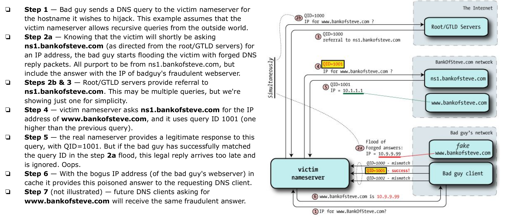

# DNS security

Domain Name Service è una delle risorse più importanti e più vecchie dell'intera infrastruttura di internet. Questo suggerisce che è stato sviluppato senza avere la sicurezza in mente: infatti analizzandolo si trovani diverse vulnerabilità.

## Recap sul DNS
Si tratta di un protocollo che interagisce con un database distribuito di tipo chiave-valore. Lo spazio dei nomi è gerarchico, e la struttura è la seguente: c'è un server `root`, poi `Top Level Domain (TLD)`, poi `Second Level Domain (SLD)`, una serie di `subdomain` e infine gli hosts. Quando un client fa una richiesta a un server, se non contiene in cache la destinazione, il client contatta un DNS resolver che si occupa di gestire la richiesta ricorsivamente: prima contatta il _root nameserver_, che risponde con l'IP del _TLD nameserver_ che è in gradi di gestire la richiesta. IL TLD nameserver risponde con l'IP dell'_authoritative nameserver_ per una certa zona che finalmente risponde con l'IP cercato. L'intero meccanismo è messo in piedi solo se il DNS resolver non memorizza in cache il record cercato. 

## Vulnerabilità

### DNS spoofing && cache poisoning

L'idea è quella di introdurre un record fasullo nella cache del DNS resolver. Tuttavia, far funzionare questo attacco non è così facile: il DNS resolver mantiene una lista di query in attesa "aperte", cioè non ancora risolte, ognuna con un proprio ID e quindi accetta risposte solo se il _query ID_ della risposta coincide con uno di quelli memorizzati. Inoltre, la risposta deve essere indirizzata alla stessa porta UDP da cui è partita la richiesta, deve contenere la stessa _query section_ della richiesta e nelle sezioni _authoritative_ e _addition_ deve avere nameserver che sono nello stesso dominio della richiesta. Inoltre, come detto, il DNS resolver fa cache, quindi l'attacco è applicabile solo a record che non sono già presenti in cache. Per un attaccante, ciò che deve essere fatto è la seguente cosa:

 

Prima, gli ID delle richieste erano molto semplice da prevedere (così come la porta UDP usata), perché si trattava di un numero incrementale. La soluzione a questo attacco prevede la randomizzazione della _query ID_ e, eventualmente, anche della porta UDP usata.

### DNS tunneling
È una vulnerabilità che sfrutta il traffico DNS per inviare payload di altri protocolli. Per farlo, c'è bisogno di infettare un client con un malware e di registrare un DNS: in questo modo il malware potrà inviare comandi e dati facendo richieste DNS per hostname con questa struttura: `<base_64_encoded_payload>@<malicious-domain>.something`, dove il `malicious-domain` è quello gestito dal DNS registrato dall'attaccante. In questo modo, quando arriveranno richieste, il server potrà elaborare il payload e rispondere con un altro comando o dato codificato. Si evita anche il meccanismo delle cache perché si presuppone che la codifica base64 sia diversa per i vari comandi. Inoltre sarebbe facile da arginare anche per comandi uguali semplicemente aggiungendo un numero incrementale finale.

### Altre vulnerabilità

- `DNS hijacking`: far risolvere una query DNS in modo errato, ad esempio tramite malware, prendendo controllo di routers o intercettare una comunicazione DNS. Esistono infatti 4 diversi tipi di DNS hijacking:
    1. `Local`: si infetta un computer per cambiare il DNS locale
    2. `Router`: si prende il controllo di un router per modificare le impostazioni di default sul DNS. In questo modo l'attacco coinvolge tutti i client connessi a quel router
    3. `Man in the middle`: si intercetta la comunicazione tra un DNS server e un utente per reindirizzarlo su siti malevoli
    4. `Rogue DNS server`: quando un attaccante può prendere il controllo di un DNS server e modificarne i record

- `NXDOMAIN attack`: è un attacco DoS che si ottiene facendo flooding di richieste verso il DNS server

- `Phantom domain attack`: è un attacco DoS in cui l'attaccante mette in piedi una serie di _domain servers_ che rispondono lentamente o non rispondono. Il DNS target è poi inondato con richieste verso domini gestiti da questi DNS phantom portando a rallentamenti o, appunto, DoS.

- `Random subdomain attack`: si fa DoS su un target DNS authoritative server. Si fa flooding di richieste di sottodomini random gestiti da quel DNS server.

- `DNS query confidentiality`: i dati viaggiano in chiaro su internet!

- `Amplification`: i dati DNS viaggiano tipicamente su UDP. Per un attaccante è quindi possibile catturare e replicare richieste che un client effettua a un DNS. Inondando un DNS server con la stessa richiesta, la vittima riceverà un gran numero di risposte inattese e con una quantità di dati maggiore rispetto alla richiesta.

## Soluzioni

### DNSSEC
Non si cambia il modo di funzionare di DNS legacy, ma si aggiungo particolari tipi di record:
- `RRSIG`: per firme crittografiche
- `DNSKEY`: per chiavi pubbliche
- `DS`: per hash delle chiavi
- `NSEC` && `NSEC3`: entrambi con lo scopo di dichiarare esplicitamente la non esistenza di domini

Ogni server autoritativo ha lo scopo di cifrare i propri `record set` (RRset): è l'insieme di record che hanno tutti la stessa tipologia (e.g: A) e lo stesso hostname. Questi RRset vengono cifrati con crittografia asimmetrica usando la cosiddetta `Zone Signing Key` (ZSK). Quando si richiede la risoluzione di un hostname, quindi, viene restituito l'RRset relativo, una firma dell'RRset calcolato con la ZSK privata e la chiave pubblica ZSK per decifrarlo. Questo non basta a rendere sicuro il protocollo: c'è bisogno di autenticare anche la chiave pubblica ZSK. Per questo motivo, viene creata anche la coppia di chiavi `Key Signing Key`: oltre alle informazioni sopra citate, vengono restituite anche una firma per la chiave ZSK pubblica, firmata con la chiave privata KSK e la chiave pubblica KSK. 

In realtà, anche la chiave pubblica KSK è firmata con la chiave privata KSK, ma questo non offre ulteriore sicurezza. Abbiamo bisogno di autenticare anche la chiave KSK, senza contare che la risoluzione di un hostname passa attraverso diversi livelli che devono essere a loro volta autenticati. Per questo motivo esiste il record di tipo `Delegation Signer (DS)`: serve a trasferire fiduca da una zona parent a una child. Quando un operatore di una zona genera una coppia di KSK, calcola l'hash del DNSKEY record e la consegna alla zona parent che la memorizza in un record DS. Lo stesso procedimento è ripetuto per tutti i livelli della gerarchia fino alla root, quando non esiste un livello superiore a cui consegnare l'hash del record DNSKEY. La sicurezza relativa a quella parte risiede nel come è gestita la creazione del record RRSIG della chiave KSK pubblica. Infatti, per generarlo, avviene una cerimonia pubblica e molto seguita; la chiave privata, infine, deve essere custodita in modo sicuro perché è quella che rende sicuro l'intero meccanismo.

In fase di verifica, quindi, alla generica zona intermedia, si riceve: 
- l'RRset per l'ip cercato (o per il DNS server di livello inferiore)
- i record DNSKEY contenenti chiavi ZSK e KSK
- i record RRSIG delle chiavi ZSK e KSK
- il record DS contenente l'hash della KSK della zona inferiore.

e si fanno i seguenti controlli:
- si verifica che l'hash della KSK calcolata coincida con quella contenuta nel record DS ricevuta dal livello superiore
- si verifica con la chiave pubblica KSK la chiave ZSK
- si verifica con la chiave ZSK l'RRset ricevuto

Se tutti i controlli vengono superati, l'RRset è ritenuto valido.

Per come funziona il protocollo, anche risposte a richieste per domini non esistenti devono essere autenticate. Ma il DNS legacy risponde con un record NX vuoto. Per risolvere il problema, DNSSEC utilizza i record di tipo NSEC e NSEC3. 

Il record NSEC inserisce come dati per autenticare la risposta l'RRset che memorizza il primo hostname valido successivo in ordine alfabetico rispetto a quello richiesto. Il problema di questo approccio è che permette in questo modo di comprendere quali sottodomini sono presenti. 

Il record NSEC3 invece restituisce gli RRset validi relativi agli hostname precedente e successivo, ma inserendo al posto del sottodominio l'hash saltato. Anche qui, però, c'è possibilità di enumerazione per i sottodomini: infatti si tratta di fare un attacco a dizionario e, per sottodimini facili, non è complicato ottenere un match.

Una possibile soluzione a questo problema è quella di utilizzare i cosidetti `white lies`: si genera un sottodominio farlocco e si firma al momento. Tuttavia, anche qui, ci sono problematiche: firmare on-the-fly nuovi dati con crittografia asimmetrica può essere costoso a livello computazionale, rendendo i DNS server vulnerabili a attacchi DoS. Inoltre, affinchè sia possibile firmare, è necessario che la chiave privata sia direttametne accessibile ma memorizzarla su un server direttamente connesso ad internet è un potenziale rischio.

DNSSEC, inoltre, non risolve il problema dell'amplificazione ma, anzi, lo peggiora: infatti i dati ricevuti in risposta per una singola richiesta DNSSEC sono molti di più rispetto a quella di una richiesta DNS legacy.

### DNS su TLS o HTTPS

Sono due alternative che offrono anche confidenzialità: i dati verrebbero cifrati su una connessione TLS. Tuttavia, in questo caso, sarebbe necessario mantenere una connessione TCP attiva in modo da sfruttarla per più richieste piuttosto che chiuderla subito dopo aver interagito per una richiesta: l'handshake TCP e TLS potrebbero diventare pesanti. 

