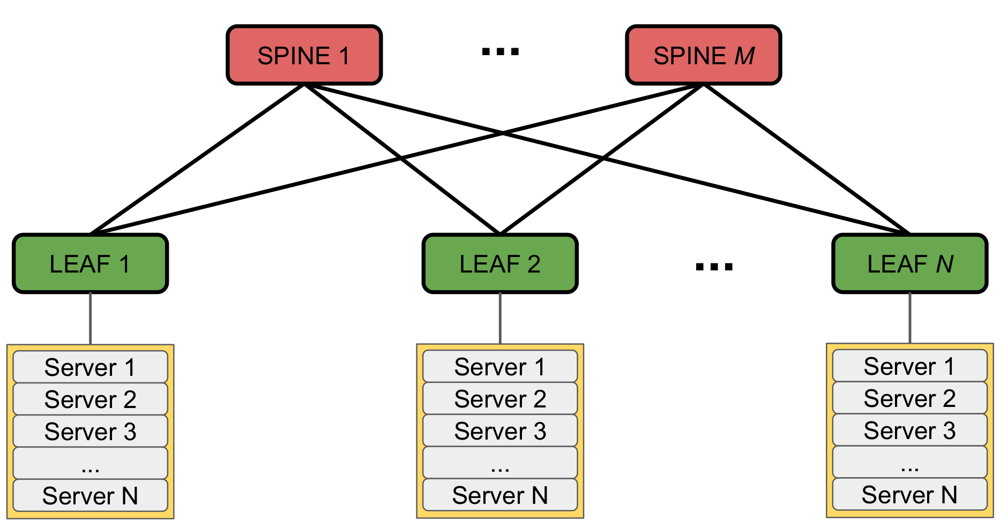
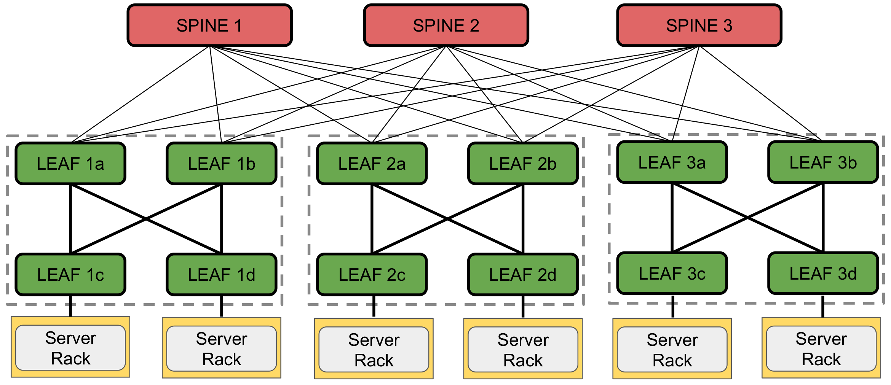

# VXLAN
## Datacenter network
Sono reti composte da diversi server che devono comunicare tra loro tramite una rete interna. È tipicamente strutturata in _tiers_, ognuno con una specifica tecnologia:

- `Access switches`, anche detti `Top of Rack` (ToR): costituiscono il livello più basso e permettono ai server di accedere alla rete overlay.
- `Aggregation switches`, anche detti `End of Rack` (EoR): aggregano gruppi di ToR
- `Core switches`: gestiscono l'intero traffico dei datacenter e lo instradano su internet; perciò devono supportare la totalità della banda della rete. 

Questa architettura è limitante sotto diversi punti di vista:
- la gestione del carico della rete è affidata ai `cores`: devono supportare tutta la banda
- come conseguenza del punto precedente, i dispositivi risultano costosi per i livelli alti
- i router ToR sono single point of failure per i server connessi: se va giù, i server restano isolati

Una rete di questo tipo deve avere i seguenti punti chiave:
- scalabilità: l'aggiunta di server deve essere possibile senza intaccare l'architettura
- ridondanza: è necessaria replicazione soprattutto per la tolleranza ai guasti
- tenants isolation: la virtualizzazione in cloud deve prevedere l'isolamente tra i tenants, sia per performance che sicurezza

Le caratteristiche di latenza e capacità di rete dipendono invece dall'applicazione: la prima è tipicamente legata al _diametro della rete_, mentre la seconda cresce in base alla grandezza della rete stessa.

> diametro di rete: è la massima lunghezza dell'insieme dei percorsi minimi di ogni coppia di nodi

## Clos topology
L'idea di base è quella di avere molti dispositivi poco costosi con ridondanza di interconnessione tra di loro

### 2-tier topology: leaf-spine

 

Ogni foglia, che è uno switch, è connessa a tutte le spine. Si hanno i seguenti svantaggi:

- se c'è bisogno di più banda, basta aggiungere una spina
- se una spina fallisce, non c'è isolamento perché ci sono link verso le altre spine
- se servono più server basta aggiungere una foglia e collegarla alle spine

Tuttavia, se una foglia fallisce, i server ad essa connessi risultano isolati. Per questo motivo esistono prototocolli per _fault tolerance_ delle spine:

- LAG: si aggregano virtualmente diversi link fisici in modo da avere un unico link virtuale. Si gestisce il fallimeto dei link.

- MLAG: la ridondanza è anche a livello di switch: ci sono più foglie collegate tra loro 

### 3-tier: fat-tree

 

Si ottiene dal leaf-spine "esplodendo" una foglia in un gruppo di 4 foglie totalmente connesse. L'insieme di queste 4 foglie è detto `pod`. Tra i vantaggi, si ha che gli switch sono switch commerciali poco costosi e possibilità di avere una grande scalabilità sul numero di nodi.

## VXLAN
Per quanto riguarda il forwarding, a livello 2 abbiamo un sacco di problemi:
- prima di tutto, lo _spanning tree protocol_ usato per evitare i loop mantiene un solo link attivo per porta, annullando ogni tentativo di bilanciare il carico
- poiché c'è possibilità di virtualizzazione, gli indirizzi MAC possono essere replicati tra _tenants_ diversi: c'è bisogno di isolamento

Per risolvere questi problemi, si fa tunneling a livello 3: si sfrutta `VXLAN` per incapsulare un dataframe di livello 2 in un pacchetto UDP/IP. Sta per `Virtual eXtensible Local Area Network`, ed è una estensione delle VLAN perché usa 24 bits per gli identificatori (contro i 12 bits del classico _VLAN tag_). Tra i vantaggi di questo approccio, c'è il poter sfruttare `ip` per fare load balancing del carico e il tunneling può interessare soltanto i nodi edge della rete virtualizzata, chiamati `VXLAN Tunnel End Point` (VTEP), tipicamente sono le foglie.

Poiché il singolo tenant può gestire diverse sottoreti, può capitare che queste debbano interagire.

> Nota: l'isolamento è solo tra reti di tenats diversi

In questo caso, poiché cambia il dominio broadcast, non si può incapsulare un frame di livello 2 in VXLAN, ma si incapsula un pacchetto di livello 3. Il campo `vni` dell'header VXLAN si chiama, in questo caso, `L3VNI` ed è associato al singolo tenant. Per fare instradamento in modo corretto, c'è bisogno poi di avere una `Routing & Forwarding Table` (RFT) sul `VTEP` di destinazione. Quindi, quando si vuole comunicare con una VLAN diversa, il processo è questo:

- il VTEP sorgente incapsula un **pacchetto IP** dentro uno VXLAN (non un pacchetto di livello 2)
- Il pacchetto VXLAN viene incapsulato a sua volta in un pacchetto UDP/IP e si fa routing basato sull'header esterno per arrivare alla fine del tunnel sull'altro VTEP. Quindi l'header esterno con terrà l'ip del VTEP destinatario, mentre quello interno l'indirizzo dell'end-point.
- Il VTEP destinatario rimuove l'header esterno e si ritrova un header VXLAN con un L3VNI. 
- Usa L3VNI per recuperare dalla sua RFT tutte le diverse VLAN associate a quel tenant (L3VNI è uno per tenant, anche se possono esserci diverse VLAN gestite dallo stesso tenant) 
- Tra le VLAN trovate, il pacchetto si instrada in quella a cui appartiene l'indirizzo IP presente nell'header interno

A livello di prestazioni questo protocollo risulta pesante da fare a livello software a causa dei vari incapsulamenti, mentre gli switch foglie hanno sempre il supporto hardware per farlo.

## ECMP
è la soluzione più semplice usata oggi per fare load balancing. Si calcola un'hash sulla 5-tupla composta dai campi:
    - ip sorgente
    - ip destinazione
    - porta sorgente
    - porta destinazione
    - protocollo (UDP/TCP)

I campi usati sono tutti relativi all'header esterno, in modo da poter essere usati da tutti i nodi. Il risultato dell'hash viene poi utilizzato per determinare l'interfaccia verso cui inviare i pacchetti. In questo modo, per il singolo flusso di dati tra due nodi il link usato sarà sempre lo stesso, eliminando il rischio di avere pacchetti out-of-order a causa della congestione su uno dei diversi path seguiti, il che sarebbe dannoso per connessioni TCP.

Nel contesto di VXLAN, dati una coppia di VTEP, l'unico elemento della 5-tupla che cambia è la porta sorgente. Per evitare che venga scelta sempre la stessa porta sorgente (e quindi lo stesso path), un VTEP calcola la porta sorgente in base al risultato di una prima hash del pacchetto interno.

## Lab
<!--todo-->